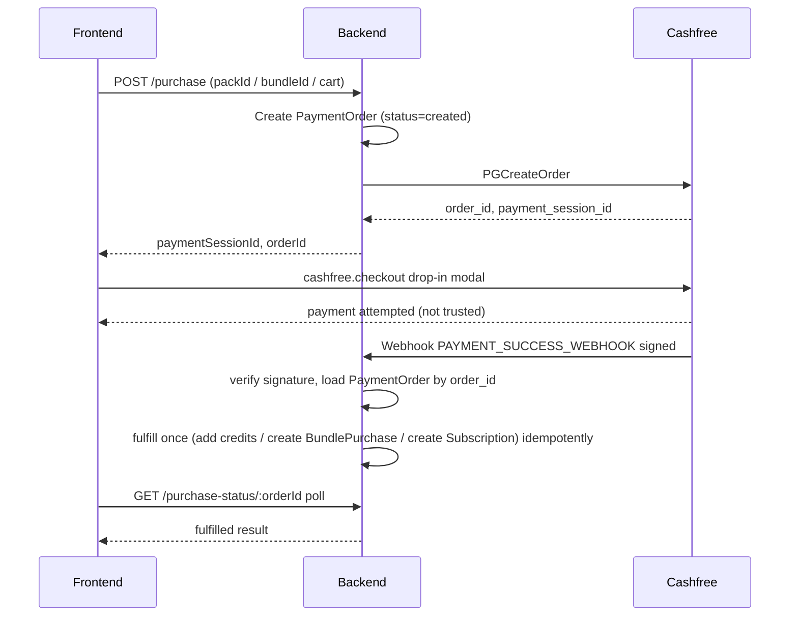
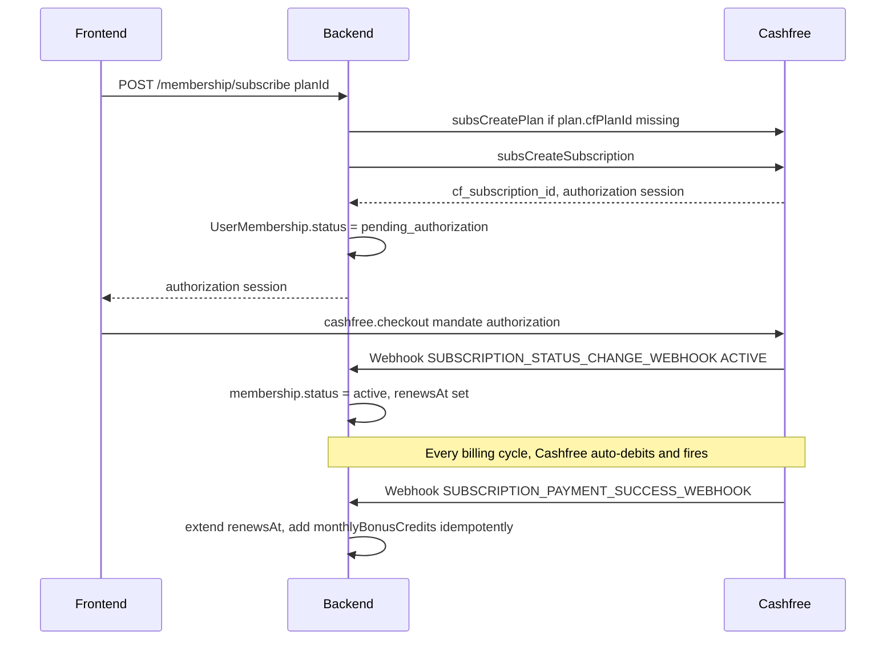

# Cashfree Payment Gateway Integration

## Why this needs care

Right now every "payment" in the app ([server/services/paymentService.js](server/services/paymentService.js)) is a mock that returns success instantly and the caller immediately grants credits / creates records. Real payments are asynchronous: the user is redirected to a checkout UI, and the *only* trustworthy confirmation is a signed webhook (or a server-side status fetch) — never the client-side callback. This changes the shape of every purchase flow from "call API, get result" to "call API, get a payment session, open Cashfree checkout, wait for confirmation."

This plan touches 4 purchase surfaces:
- Wallet credit top-ups ([server/controllers/wallet.controller.js](server/controllers/wallet.controller.js))
- HR Bundle a-la-carte purchases ([server/services/bundleService.js](server/services/bundleService.js))
- Job Finder a-la-carte checkout ([server/services/subscriptionService.js](server/services/subscriptionService.js))
- Membership recurring subscriptions ([server/routes/membership.routes.js](server/routes/membership.routes.js))

Credit-based payments (spending in-app wallet balance) are **not** touched — those stay instant/internal since no money movement happens at that point.

## Flow diagrams

### One-time payment (wallet top-up / bundle / job-finder a-la-carte)

### Membership recurring subscription

## 1. Dependencies and config

- Backend: `npm install cashfree-pg` in [server/package.json](server/package.json) (single SDK covers both `Cashfree.PGCreateOrder`/`PGFetchOrder`/`PGVerifyWebhookSignature` for one-time orders, and `SubscriptionApi` for `subsCreatePlan`/`subsCreateSubscription`/`subsFetchSubscription`/cancel).
- Frontend: `npm install @cashfreepayments/cashfree-js` — exposes `load({ mode })` returning a `cashfree` object with `cashfree.checkout({ paymentSessionId, redirectTarget: "_modal" })`.
- New env vars in [server/.env.example](server/.env.example) and `server/.env`:
  - `CASHFREE_APP_ID`, `CASHFREE_SECRET_KEY`
  - `CASHFREE_ENV=SANDBOX` (switch to `PRODUCTION` later)
  - `CASHFREE_API_VERSION=2025-01-01`
  - `SERVER_PUBLIC_URL` — public HTTPS base URL used to build `notify_url` (webhook) and `return_url`. For local dev this must be an ngrok/tunnel URL since Cashfree cannot call `localhost`.
- Frontend env: `VITE_CASHFREE_MODE=sandbox`.

## 2. Data model changes

- New model `server/models/PaymentOrder.js`: `userId`, `cfOrderId` (unique, indexed), `orderType` (`wallet_topup` | `bundle` | `job_finder_checkout`), `referenceId` (packId/bundleId) or `cartItems` (for job-finder), `paymentMethod`, `amount`, `currency`, `status` (`created` | `paid` | `failed`), `fulfilledAt`, timestamps. Single indexed lookup by `cfOrderId` on webhook — no joins.
- [server/models/MembershipPlan.js](server/models/MembershipPlan.js): add `cfPlanId` (cached Cashfree plan id, created lazily on first subscribe to that tier).
- [server/models/UserMembership.js](server/models/UserMembership.js): rename/repurpose `paymentProviderRef` to store `cfSubscriptionId` (add index), add `status` enum value `pending_authorization`, add `lastPaymentId` for webhook idempotency (skip if same `cf_payment_id` seen twice).
- New lightweight `server/models/WebhookEvent.js` (optional but recommended): `eventId` (unique), `type`, `processedAt` — guards against Cashfree's webhook retry policy causing double-fulfillment, checked with one indexed `findOne`/insert before processing.

## 3. Backend services

- `server/services/cashfreeClient.js` (new): initializes `Cashfree` singleton from env (`CASHFREE_APP_ID`/`CASHFREE_SECRET_KEY`/`CASHFREE_ENV`), exports the configured instance plus a `verifyWebhookSignature(signature, rawBody, timestamp)` helper.
- Rewrite [server/services/paymentService.js](server/services/paymentService.js), replacing every mock function:
  - `createOrder({ userId, amount, orderType, referenceId })` → persists `PaymentOrder`, calls `Cashfree.PGCreateOrder`, returns `{ orderId, paymentSessionId }`.
  - `createSubscription({ userId, plan })` → ensures `plan.cfPlanId` exists (calls `subsCreatePlan` once, caches on `MembershipPlan`), calls `subsCreateSubscription`, returns authorization session.
  - `cancelSubscription(cfSubscriptionId)` → calls subscription cancel/status-update API.
  - Drop `chargeOneTime`/`createRecurringMandate` mocks entirely; nothing in the codebase should call a mock path anymore.
- New `server/services/paymentWebhookService.js`: single dispatcher used by the webhook route — verifies signature, checks `WebhookEvent` idempotency, and routes by `type`:
  - `PAYMENT_SUCCESS_WEBHOOK` → load `PaymentOrder` by `cfOrderId`, if still `created` mark `paid` and fulfill (`walletService.addCredits`, or create `BundlePurchase`, or create `Subscription` docs via the existing logic already in [server/services/subscriptionService.js](server/services/subscriptionService.js)).
  - `PAYMENT_FAILED_WEBHOOK` → mark `PaymentOrder.status = failed`.
  - `SUBSCRIPTION_STATUS_CHANGE_WEBHOOK` (ACTIVE/CANCELLED/ON_HOLD) → update `UserMembership.status`.
  - `SUBSCRIPTION_PAYMENT_SUCCESS_WEBHOOK` → the real renewal trigger: extend `renewsAt` by one billing cycle, add `monthlyBonusCredits` (guarded by `lastPaymentId` check for idempotency).
  - `SUBSCRIPTION_PAYMENT_FAILED_WEBHOOK` → set `status = past_due`.

## 4. Backend routes/controllers

- New `server/routes/payments.routes.js` → `POST /api/payments/webhook`. This route must read the **raw** request body for signature verification, so it's mounted with `express.raw({ type: 'application/json' })` *before* the global `express.json()` in [server/index.js](server/index.js) (or via a `verify` callback scoped only to this path). Returns `200` immediately after processing to avoid Cashfree retries; invalid signature → `400`.
- [server/controllers/wallet.controller.js](server/controllers/wallet.controller.js) `purchasePack`: instead of instant `addCredits`, calls `paymentService.createOrder({ orderType: 'wallet_topup', referenceId: pack._id, amount: pack.price })`, returns `{ orderId, paymentSessionId }`.
  - New `GET /api/wallet/orders/:orderId` (REST-style status lookup) for the frontend to poll after the Drop-in modal closes.
- [server/services/bundleService.js](server/services/bundleService.js) `purchaseBundle`: for `paymentMethod === 'alacarte'`, create a Cashfree order (same pattern) instead of instant `BundlePurchase.save()`; `credits` path stays instant wallet spend.
  - New `GET /api/bundles/orders/:orderId` status endpoint.
- [server/services/subscriptionService.js](server/services/subscriptionService.js) `checkout`: for `paymentMethod === 'alacarte'`, create a Cashfree order carrying the cart as `referenceId` instead of charging via the old mock and creating `Subscription` docs synchronously; `credits` path stays instant. Fulfillment (actual `Subscription.create`) moves into the webhook handler.
  - New `GET /api/subscriptions/orders/:orderId` status endpoint.
- [server/routes/membership.routes.js](server/routes/membership.routes.js) `subscribe`: for paid tiers, replace `createRecurringMandate`/`chargeOneTime` with `paymentService.createSubscription`; membership is set to `pending_authorization` until the webhook confirms `ACTIVE`. Response includes the authorization session for the frontend to open.
  - `cancel`: calls the real `cancelSubscription`.

## 5. Renewal job rewrite

[server/services/membershipRenewalJob.js](server/services/membershipRenewalJob.js) no longer performs charges — Cashfree's subscription engine auto-debits on schedule and the webhook (`SUBSCRIPTION_PAYMENT_SUCCESS_WEBHOOK`) is what extends `renewsAt` and grants credits. The job's remaining job: reconcile stuck states — e.g. downgrade to Free once a `cancelAtPeriodEnd` membership's Cashfree subscription reports `CANCELLED`/`COMPLETED`, and flag memberships stuck in `pending_authorization` or `past_due` past a grace period. Runs less frequently (e.g. every few hours) since it's now a safety net, not the primary billing mechanism.

## 6. Frontend changes

- New `src/lib/cashfree.js`: lazy-loads `@cashfreepayments/cashfree-js`, exposes `openCashfreeCheckout(paymentSessionId)` returning the SDK's promise (`redirectTarget: "_modal"`), reading `VITE_CASHFREE_MODE` for sandbox/production.
- [src/lib/api.js](src/lib/api.js): update return shapes —
  - `walletApi.purchasePack` → returns `{ orderId, paymentSessionId }`; add `walletApi.getOrderStatus(orderId)`.
  - `bundlesApi.purchaseBundle` → same pattern for `alacarte`; add `bundlesApi.getOrderStatus(orderId)`.
  - `jobFinderApi.checkout` → same pattern for `alacarte`; add `jobFinderApi.getOrderStatus(orderId)`.
  - `membershipApi.subscribe` → returns authorization session info instead of an immediately-active membership.
- [src/pages/job-finder/WalletPage.jsx](src/pages/job-finder/WalletPage.jsx) `handlePurchase`: call purchase → open Cashfree modal via `src/lib/cashfree.js` → on modal resolution, poll `getOrderStatus` (short interval/backoff, few retries) → on `paid`, `refreshWallet()` and toast success; on `failed`/timeout, toast failure.
- [src/pages/cold-mailer/BundleCheckoutPage.jsx](src/pages/cold-mailer/BundleCheckoutPage.jsx): same pattern for the `alacarte` branch only; `credits` branch unchanged.
- [src/pages/job-finder/CheckoutPage.jsx](src/pages/job-finder/CheckoutPage.jsx): same pattern for the `alacarte` branch only.
- [src/pages/billing/MembershipPage.jsx](src/pages/billing/MembershipPage.jsx) `handleSubscribe`: for paid tiers, open Cashfree checkout with the authorization session, then poll `membershipApi.getMe()` until `status` becomes `active` (or timeout with a "still processing" message), replacing the current `window.location.reload()`.

## 7. Testing / rollout

1. Add sandbox `CASHFREE_APP_ID`/`CASHFREE_SECRET_KEY` to `server/.env`; run a tunnel (ngrok) for `SERVER_PUBLIC_URL` and register that webhook URL in the Cashfree sandbox dashboard.
2. Implement in order: `PaymentOrder` model + webhook route/signature verification skeleton → wallet top-up (simplest, single item) → bundle a-la-carte → job-finder a-la-carte checkout → membership subscriptions (most complex, recurring) → renewal job rewrite.
3. Test each flow against Cashfree's documented sandbox test payment instruments (test cards/UPI/eNACH) end-to-end including webhook delivery, then re-point env vars to production credentials.

## Notes on constraints followed

- REST conventions: new endpoints follow existing resource-based patterns (`GET /api/wallet/orders/:orderId`, `POST /api/payments/webhook`), reusing existing route files where the resource already exists.
- No joins/complex queries: all new lookups (`PaymentOrder` by `cfOrderId`, `UserMembership` by `cfSubscriptionId`) are single indexed `findOne` calls; fulfillment logic stays in services, not embedded in controllers.
