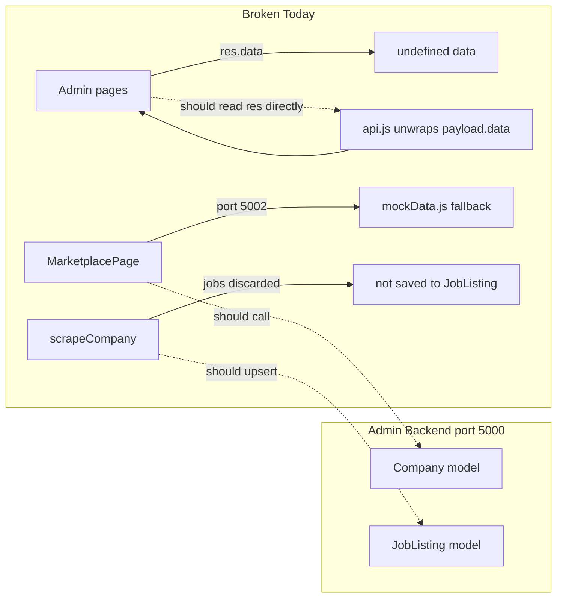

# Fix Admin Dashboard Integration

## Diagnosis

The admin stack is **wired structurally** (routes, guards, models, API client methods) but **not functionally integrated**. Three root problems:



### P0 — Breaks all admin pages

[`src/lib/api.js`](src/lib/api.js) line 37 already unwraps `{ data: ... }`:

```37:37:src/lib/api.js
    return payload?.data ?? payload;
```

But every admin page reads `.data` again, e.g. [`AdminOverviewPage.jsx`](src/pages/admin/AdminOverviewPage.jsx) line 11:

```javascript
.then(res => setStats(res.data))  // res.data is undefined
```

Same bug in all 7 data-fetching admin pages, plus scrape toast in [`AdminCompaniesPage.jsx`](src/pages/admin/AdminCompaniesPage.jsx) line 31 (`res.data.stats`).

### P1 — Admin data not connected to user app

- Admin CRUDs `Company` records on port 5000
- Job Finder marketplace in [`MarketplacePage.jsx`](src/pages/job-finder/MarketplacePage.jsx) calls `jobFinderApi` on **non-existent port 5002** and falls back to [`mockData.js`](src/pages/job-finder/mockData.js)
- Scraper runs in [`admin.controller.js`](server/controllers/admin.controller.js) lines 86–95 but **never writes** to [`JobListing`](server/models/JobListing.js)

### P2 — Incomplete admin UI

- Add/Edit buttons on Companies, Bundles, Credit Packs pages have **no handlers** — backend create/update endpoints exist but are unused
- [`AdminTransactionsPage.jsx`](src/pages/admin/AdminTransactionsPage.jsx) uses wrong wallet field names (`type: 'credit'`, `amount`) vs actual schema (`type: 'purchase'|'spend'`, `credits`) in [`Wallet.js`](server/models/Wallet.js)
- [`AdminSettingsPage.jsx`](src/pages/admin/AdminSettingsPage.jsx) is entirely static (defer to later)

### P3 — Auth/navigation gaps

- No admin link in user sidebar for admin users ([`UserMenu.jsx`](src/components/layout/UserMenu.jsx))
- `/dashboard` has no auth guard (out of scope for minimal fix but noted)
- `CompanyProductCard` expects `company.id` but MongoDB returns `_id`

---

## Phase 1 — Fix admin data display (P0)

**Goal:** Make all existing admin pages show real data immediately.

In every admin page, remove the extra `.data` access. Use the value returned by `adminApi` directly:

| File | Change |
|------|--------|
| [`AdminOverviewPage.jsx`](src/pages/admin/AdminOverviewPage.jsx) | `setStats(res)` not `res.data`; add 5th stat card for `totalWaitlist` |
| [`AdminCompaniesPage.jsx`](src/pages/admin/AdminCompaniesPage.jsx) | `setCompanies(res)`; scrape toast: `res.stats.totalJobs` |
| [`AdminBundlesPage.jsx`](src/pages/admin/AdminBundlesPage.jsx) | `setBundles(res)` |
| [`AdminCreditPacksPage.jsx`](src/pages/admin/AdminCreditPacksPage.jsx) | `setPacks(res)` |
| [`AdminUsersPage.jsx`](src/pages/admin/AdminUsersPage.jsx) | `setUsers(res)` |
| [`AdminWaitlistPage.jsx`](src/pages/admin/AdminWaitlistPage.jsx) | `setEntries(res)` |
| [`AdminTransactionsPage.jsx`](src/pages/admin/AdminTransactionsPage.jsx) | `setData(res)` |

---

## Phase 2 — Fix transactions page (P2)

**Backend** — [`admin.controller.js`](server/controllers/admin.controller.js) `listTransactions`:
- Remove `userEmail: w.userEmail` injection (field doesn't exist on Wallet singleton)
- Map transactions with `walletId` only, or add a note that wallet is shared

**Frontend** — [`AdminTransactionsPage.jsx`](src/pages/admin/AdminTransactionsPage.jsx):
- Filter `t.type === 'purchase'` (not `'credit'`)
- Sum `t.credits` (not `t.amount`)
- Display `+/-` based on `purchase` vs `spend`
- Remove or replace `userEmail` column (wallet is singleton — show "Shared Wallet" or drop column)

---

## Phase 3 — Wire admin CRUD forms (P2)

Add a shared modal pattern (inline in each page, matching existing admin dark theme) for create/edit:

### Companies — [`AdminCompaniesPage.jsx`](src/pages/admin/AdminCompaniesPage.jsx)
Wire "Add Company" and "Edit" to `adminApi.createCompany` / `adminApi.updateCompany`.

Form fields matching [`Company.js`](server/models/Company.js): `name`, `logoUrl`, `category`, `tier`, `description`, `careersPageUrl`, `creditCost`, `alaCartePrice`, `isActive`.

### Bundles — [`AdminBundlesPage.jsx`](src/pages/admin/AdminBundlesPage.jsx)
Wire create/edit to `adminApi.createBundle` / `adminApi.updateBundle`.
Wire CSV upload button to `adminApi.uploadBundleContacts(id, contacts)` (parse CSV client-side with existing papaparse pattern from cold mailer, or accept JSON array).

### Credit Packs — [`AdminCreditPacksPage.jsx`](src/pages/admin/AdminCreditPacksPage.jsx)
Wire create/edit to `adminApi.createCreditPack` / `adminApi.updateCreditPack`.

Fields: `name`, `credits`, `price`, `badge`, `isActive`.

---

## Phase 4 — Connect Job Finder marketplace to admin companies (P1)

**Backend** — new public route on main server:

New file: [`server/routes/marketplace.routes.js`](server/routes/marketplace.routes.js)
```
GET /api/marketplace/companies  →  Company.find({ isActive: true })
```

New controller method or inline in routes file. Map `_id` → `id` in response so [`CompanyProductCard.jsx`](src/components/job-finder/CompanyProductCard.jsx) works without changes:

```javascript
companies.map(c => ({ id: c._id, ...c.toObject() }))
```

Mount in [`server/index.js`](server/index.js): `app.use('/api/marketplace', marketplaceRoutes)`

**Frontend** — [`src/lib/api.js`](src/lib/api.js):
- Change `jobFinderApi.listMarketplaceCompanies` to call main server: `api.get('/marketplace/companies')` instead of port 5002
- Remove `withMockFallback` for companies in [`MarketplacePage.jsx`](src/pages/job-finder/MarketplacePage.jsx) (keep mock only for subscriptions until that API exists)

**Seed script** — new [`server/seed/seedCompanies.js`](server/seed/seedCompanies.js) with 3–5 sample companies (Stripe, etc.) so marketplace isn't empty on first run. Add `"seed:companies"` npm script in [`server/package.json`](server/package.json).

---

## Phase 5 — Persist scraped jobs to JobListing (P1)

In [`admin.controller.js`](server/controllers/admin.controller.js) `scrapeCompany`, after scraper returns:

1. For each job in `result.jobs`, upsert into `JobListing` by `{ companyId, url }` (unique index already defined in [`JobListing.js`](server/models/JobListing.js) line 25)
2. Map scraper output fields → model fields (`experienceLevel` enum alignment)
3. Update `company.openRoles` from actual `JobListing.countDocuments({ companyId })` instead of scrape-time count
4. Return `{ stats, jobsSaved: N }` in response

This makes scraped data available for future user filtering by experience/location without re-scraping on every purchase.

---

## Phase 6 — Auth and navigation polish (P3)

### Admin link for admin users
In [`UserMenu.jsx`](src/components/layout/UserMenu.jsx), if `user.isAdmin`, add a "Admin Panel" menu item linking to `/admin`.

### Stale token cleanup
In [`AdminRoute.jsx`](src/components/auth/AdminRoute.jsx), on `/auth/me` failure, clear `cn_token` and `cn_user` before redirecting to `/login`.

### Credit pack ID fix
In [`WalletPage.jsx`](src/pages/job-finder/WalletPage.jsx), use `pack._id || pack.id` when calling `purchasePack` so real MongoDB packs work.

---

## Out of scope (deferred)

- Full Job Finder backend (subscriptions, checkout, job filtering) — still mock/stub; only marketplace company listing is connected in this plan
- `AdminSettingsPage` real API (scraper config, Groq key management)
- Dashboard route guard (`/dashboard` auth protection)
- Per-user wallet model refactor (wallet is currently a singleton; auth signup creates invalid per-user wallets — separate cleanup)
- Daily cron scheduler for automatic scraping

---

## Verification checklist

After implementation, confirm:

1. Log in as admin → lands on `/admin`, overview shows real counts (not all zeros)
2. Add a company in admin → appears in admin table AND Job Finder marketplace at `/dashboard/job-finder`
3. Scrape a company → `openRoles` updates, toast shows job count, `JobListing` documents created in DB
4. Bundles/Credit Packs CRUD works end-to-end
5. Transactions page shows wallet purchases/spends with correct credit amounts
6. Admin users see "Admin Panel" link in user menu; non-admins visiting `/admin` redirect to `/dashboard`
