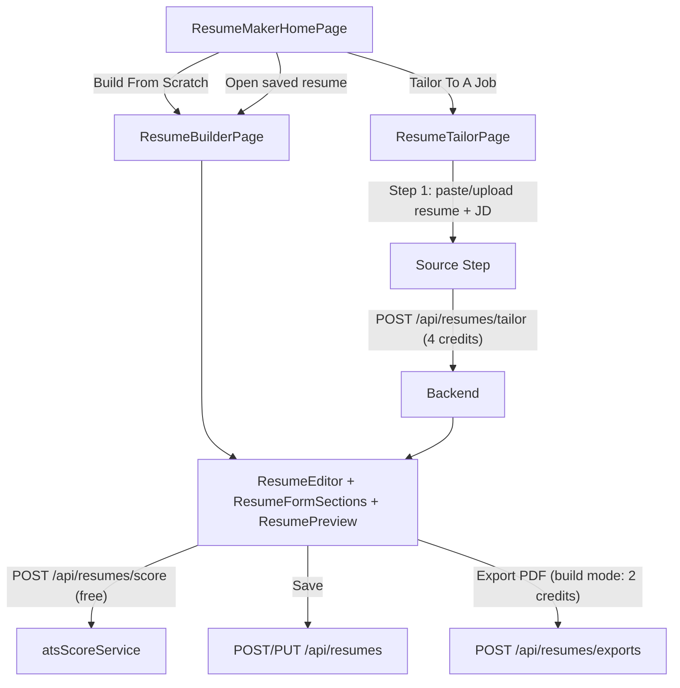

# Functional AI Resume Maker

## Current state
- [src/pages/ResumeMakerPage.jsx](src/pages/ResumeMakerPage.jsx) is a single flat page: manual form builder ([src/components/resume/ResumeFormSections.jsx](src/components/resume/ResumeFormSections.jsx)) + live preview ([src/components/resume/ResumePreview.jsx](src/components/resume/ResumePreview.jsx)) + `window.print()` export gated by a 2-credit wallet deduction.
- [server/routes/resume.routes.js](server/routes/resume.routes.js) only exposes `POST /api/resume/generate` (credit deduction) and currently imports `authMiddleware` as a default export when [server/middleware/auth.middleware.js](server/middleware/auth.middleware.js) only exports named `{ requireAuth }` — the route is effectively broken and needs fixing.
- No `Resume` DB model, no AI tailoring, no ATS scoring, no upload/parsing exists today. AI usage elsewhere ([server/services/aiService.js](server/services/aiService.js)) calls Groq (`llama-3.3-70b-versatile`) directly via axios with a JSON-extraction helper — we'll reuse this exact pattern.

## Decisions (confirmed)
- Resumes are **persisted to the DB** per user (new `Resume` model + REST CRUD) so users can revisit/edit saved resumes.
- **Analyze & Tailor** (AI) action costs **4 credits**. Manual **Build → Export PDF** keeps its existing **2 credits**. Exporting the *already-tailored* resume is free (the 4 credits cover the AI work). Recalculating the ATS score after edits is **free** (pure JS, no AI call).

## Architecture



## Backend changes

### New dependencies (`server/package.json`)
- `pdf-parse` — extract text from uploaded PDF resumes
- `mammoth` — extract text from uploaded DOCX resumes

### New model — `server/models/Resume.js`
```js
{
  userId: ObjectId (ref User, required),
  title: String,
  mode: 'scratch' | 'tailored',
  data: Mixed,           // personalInfo, education, skills, experience, projects, publications, achievements
  jobDescription: String,
  atsScore: Mixed,       // { overall, breakdown, matchedKeywords, missingKeywords, suggestions }
}, { timestamps: true }
```
Simple `find`/`findOne`/`findOneAndUpdate` by `{ _id, userId }` — no joins, no loops, matching the performance rule.

### New deterministic scorer — `server/services/atsScoreService.js`
Pure JS, no AI/credits:
- `extractKeywords(jobDescription)`: tokenize, strip stopwords, rank by frequency, keep top ~25 significant terms/phrases.
- `scoreResume(resumeData, jobDescription)`: flattens resume into searchable text and computes a weighted score:
  - **Keyword match** (JD terms found in resume) — skipped/reweighted if no JD given (build mode).
  - **Completeness** (contact info, education, experience/projects, skills present).
  - **Action verbs** (bullets starting with strong verbs from a curated list).
  - **Formatting** (reasonable bullet/section lengths, no empty sections).
  - Returns `{ overall, breakdown, matchedKeywords, missingKeywords, suggestions }`.

### AI service additions — `server/services/aiService.js`
- `parseResumeText(rawText)`: Groq call, prompt converts freeform resume text into the app's exact JSON schema (same shape as `DEFAULT_RESUME_DATA`). Falls back to a minimal best-effort structure with a console warning if `GROQ_API_KEY` isn't set (mirrors existing mock-fallback pattern).
- `tailorResume(resumeData, jobDescription)`: Groq call, prompt rewrites bullets/skills to truthfully surface JD-relevant keywords (no fabricated employers/dates), reorders skills by relevance, keeps the same JSON schema. Falls back to returning `resumeData` unchanged if no API key.

### Rewritten routes/controller
- Rename `server/routes/resume.routes.js` → `server/routes/resumes.routes.js`, mount at `/api/resumes` in [server/index.js](server/index.js) (was `/api/resume`).
- `server/controllers/resumes.controller.js`:
  - `GET /api/resumes` — list current user's resumes (`.select('title mode atsScore.updatedAt createdAt')`, sorted).
  - `POST /api/resumes` — save (create).
  - `GET /api/resumes/:id` / `PUT /api/resumes/:id` / `DELETE /api/resumes/:id` — scoped to `req.user._id`.
  - `POST /api/resumes/tailor` (multer `upload.single('resumeFile')`, optional) — extracts text (pdf-parse/mammoth/plain text or `req.body.resumeText`), checks wallet balance up front, runs `aiService.parseResumeText` → `aiService.tailorResume` → `atsScoreService.scoreResume`, **then** deducts 4 credits and responds `{ data: { resume, atsScore } }`. Credits are only charged on success.
  - `POST /api/resumes/score` — free, calls `atsScoreService.scoreResume(req.body.resume, req.body.jobDescription)`.
  - `POST /api/resumes/exports` — same 2-credit wallet deduction as today's `generate`, fixes the `requireAuth` import bug.
- All routes behind `requireAuth` (fixing the current broken import).

## Frontend changes

### API client — [src/lib/api.js](src/lib/api.js)
Replace `resumeApi` with `list/get/create/update/remove/tailor/score/export` methods hitting the new `/resumes` endpoints (`postForm` for `tailor` since it may include a file).

### Routing — [src/App.jsx](src/App.jsx)
Replace the single `resume-maker` route (line 102) with three routes under `/dashboard`:
```
<Route path="resume-maker" element={<ResumeMakerHomePage />} />
<Route path="resume-maker/build" element={<ResumeBuilderPage />} />
<Route path="resume-maker/tailor" element={<ResumeTailorPage />} />
```
No sidebar/nav changes needed — [src/config/navItems.js](src/config/navItems.js) already links to `/dashboard/resume-maker`.

### New/refactored components
- `src/pages/resume-maker/ResumeMakerHomePage.jsx` — mode-selection screen: two large bento-style option cards ("Build From Scratch" / "Tailor To A Job", icons + copy consistent with [src/pages/landing/ToolkitDetail.jsx](src/pages/landing/ToolkitDetail.jsx)'s existing marketing copy), plus a "My Resumes" list (fetched via `resumeApi.list()`) showing title, mode badge, ATS score chip, and updated date, linking back into the builder/tailor editor pre-filled with saved data.
- `src/components/resume/ResumeEditor.jsx` (new, extracted from today's `ResumeMakerPage.jsx`) — the shared two-column form+preview editing surface (form sections on the left, `ResumePreview` on the right), taking `initialData`, `mode`, `jobDescription`, `atsScore` as props. Adds a **Save** button (`resumeApi.create`/`update`) and keeps the credit-gated **Export PDF** button (only charges credits in `scratch` mode).
- `src/components/resume/AtsScoreCard.jsx` (new) — hand-rolled SVG circular score gauge, per-category breakdown bars, matched/missing keyword chips (`pill-badge` style), suggestions list, and a free "Recalculate Score" button. Rendered inside `ResumeEditor` whenever an `atsScore` is present (always in tailor mode; optionally in build mode via a "Check ATS Score" toggle that lets the user paste a JD).
- `src/pages/resume-maker/ResumeBuilderPage.jsx` — thin wrapper rendering `ResumeEditor` with empty/loaded data, `mode="scratch"`.
- `src/pages/resume-maker/ResumeTailorPage.jsx` — multi-step wizard mirroring the existing stepper pattern in [src/pages/cold-mailer/NewCampaignPage.jsx](src/pages/cold-mailer/NewCampaignPage.jsx):
  1. **Source** — tabbed input: paste resume text OR upload PDF/DOCX (dashed dropzone, matching the "Add X" dashed-button style already used in `ResumeFormSections`), plus a required job description textarea.
  2. **Analyzing** — loading state while `resumeApi.tailor(formData)` runs (4 credits deducted on success).
  3. **Result** — renders `ResumeEditor` pre-filled with the tailored data + `AtsScoreCard`, with Save/Export controls.

### Styling
All new UI reuses existing utility classes/tokens (`bento-card`, `pill-btn`, `pill-badge`, `font-display uppercase`, `--color-accent-blue`/`--color-accent-yellow`, `shadow-[var(--shadow-soft)]`) and `framer-motion` transitions already used across the app — no new UI library added.

## Todos summary
1. Backend: `Resume` model, `atsScoreService`, `aiService` additions, `resumes.controller`/`resumes.routes`, mount update, add `pdf-parse`/`mammoth`.
2. Frontend: `resumeApi` client methods, route restructuring, `ResumeMakerHomePage`, `ResumeEditor` (extracted), `AtsScoreCard`, `ResumeBuilderPage`, `ResumeTailorPage`.
3. Wire credit costs (2 for scratch export, 4 for tailor, free for save/score) and verify wallet balance UX (insufficient-credit banner reused from current page).
</plan>
<todos>[{"id": "backend-model", "content": "Add Resume model (server/models/Resume.js)"}, {"id": "backend-ats-score", "content": "Implement deterministic atsScoreService.js"}, {"id": "backend-ai", "content": "Add parseResumeText & tailorResume to aiService.js"}, {"id": "backend-routes", "content": "Rewrite resumes.controller.js + resumes.routes.js, fix auth bug, mount at /api/resumes"}, {"id": "backend-deps", "content": "Add pdf-parse & mammoth to server/package.json"}, {"id": "frontend-api", "content": "Update resumeApi in src/lib/api.js"}, {"id": "frontend-routes", "content": "Restructure App.jsx routes into home/build/tailor"}, {"id": "frontend-home", "content": "Build ResumeMakerHomePage with mode cards + saved resumes list"}, {"id": "frontend-editor", "content": "Extract shared ResumeEditor from current ResumeMakerPage, add Save"}, {"id": "frontend-ats-card", "content": "Build AtsScoreCard component (gauge, breakdown, keywords, suggestions)"}, {"id": "frontend-builder-page", "content": "Build ResumeBuilderPage wrapper"}, {"id": "frontend-tailor-page", "content": "Build ResumeTailorPage wizard (source -> analyze -> result)"}]