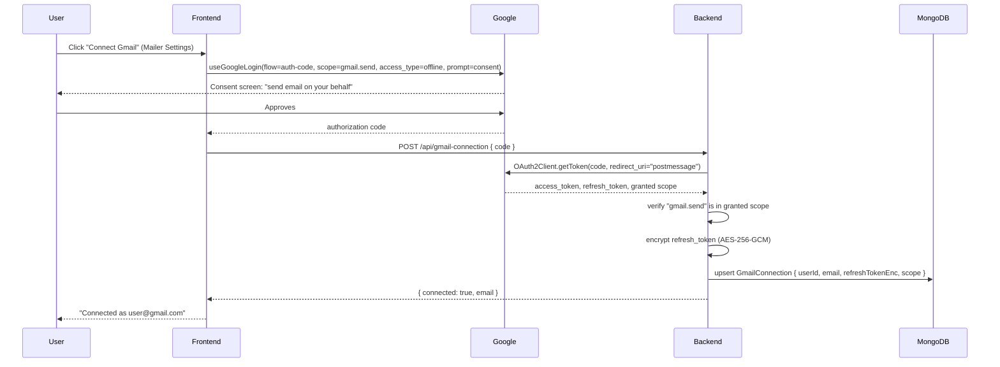
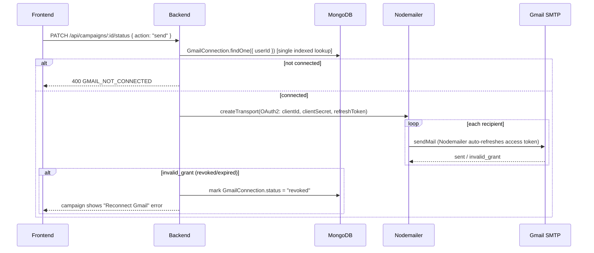

# Gmail OAuth for Cold Mailer Sending

## Important discovery that changes scope

The cold mailer is currently **single-tenant**: [server/models/Campaign.js](server/models/Campaign.js) has no `userId` field, [server/routes/campaigns.routes.js](server/routes/campaigns.routes.js) has no `requireAuth`, and [server/config/smtp.js](server/config/smtp.js) sends every campaign through one shared `SMTP_USER`/`SMTP_PASS` from `server/.env`. "Each user connects their own Gmail" is meaningless unless campaigns are first scoped to their owner, so this plan includes that scoping as a prerequisite step, not just the OAuth wiring.

## Decisions locked in (per your answers)

- Gmail consent is requested **incrementally** — only when a user clicks "Connect Gmail" in Cold Mailer settings, not during normal login/signup.
- Sending stays on **Nodemailer**, just switching the transport to OAuth2 (`clientId`/`clientSecret`/`refreshToken`) — no `googleapis` dependency, no MIME building rewrite.
- The old global app-password SMTP is **fully removed** — cold mailer becomes Gmail-OAuth-only.

## Flow 1: Connecting Gmail (one-time, per user)



## Flow 2: Sending a campaign (per user, using their own Gmail)



## 1. Scope campaigns to their owner (prerequisite)

- [server/models/Campaign.js](server/models/Campaign.js): add `userId: { type: ObjectId, ref: 'User', required: true, index: true }`.
- [server/routes/campaigns.routes.js](server/routes/campaigns.routes.js): add `router.use(requireAuth)`.
- [server/controllers/campaigns.controller.js](server/controllers/campaigns.controller.js): pass `req.user._id` into every service call.
- [server/services/campaignService.js](server/services/campaignService.js): every method (`listCampaigns`, `getCampaign`, `createCampaign`, `startCampaign`, etc.) takes/filters by `userId`; `Campaign.find()` becomes `Campaign.find({ userId })`, `Campaign.findById(id)` becomes `Campaign.findOne({ _id: id, userId })` — single indexed query, no joins, per your query-performance rule.
- Optional one-off script `server/scripts/backfillCampaignOwner.js` to assign existing ownerless campaigns to a specified user/admin (dev convenience, not required for new installs).

## 2. New `GmailConnection` model

New file `server/models/GmailConnection.js`, one doc per user (mirrors the existing `Wallet`/`UserMembership` per-user pattern already in the codebase):

- `userId` (ObjectId, ref User, unique, indexed)
- `email` (String) — connected Gmail address
- `refreshTokenEnc` (String) — AES-256-GCM encrypted refresh token
- `scope` (String) — space-delimited granted scopes, so we can confirm `gmail.send` is present
- `status` (`active` | `revoked`, default `active`)
- `connectedAt`, `lastUsedAt` (Date)

New `server/utils/tokenCrypto.js`: `encrypt(text)` / `decrypt(cipher)` using a `TOKEN_ENCRYPTION_KEY` env secret (AES-256-GCM), so a DB leak alone doesn't expose usable refresh tokens.

## 3. Backend OAuth exchange service

New `server/services/googleOAuthService.js` using the already-installed `google-auth-library`:

- `exchangeCodeForTokens(code)` — `new OAuth2Client(GOOGLE_CLIENT_ID, GOOGLE_CLIENT_SECRET)`, then `client.getToken({ code, redirect_uri: 'postmessage' })` (`postmessage` is required here because `@react-oauth/google`'s popup auth-code flow doesn't use a registered redirect URI).
- `revokeToken(refreshToken)` — calls Google's revoke endpoint.

New env vars: `GOOGLE_CLIENT_SECRET` (create in the same Google Cloud OAuth client used today) and `TOKEN_ENCRYPTION_KEY`, added to [server/.env.example](server/.env.example).

## 4. REST endpoints for the connection resource

New `server/controllers/gmailConnection.controller.js` + `server/routes/gmailConnection.routes.js`, mounted at `/api/gmail-connection` in [server/index.js](server/index.js) (mirrors the existing `/api/wallet` singular-resource-per-user pattern):

- `GET /api/gmail-connection` — `requireAuth` — returns `{ connected, email, connectedAt, status }` (never the token)
- `POST /api/gmail-connection` — `requireAuth` — body `{ code }`, exchanges code, verifies `gmail.send` scope present, upserts the encrypted connection
- `DELETE /api/gmail-connection` — `requireAuth` — revokes token with Google, deletes the record
- `POST /api/gmail-connection/test` — `requireAuth` — builds a transporter and calls `.verify()`

## 5. Per-user OAuth2 transporter

Rewrite [server/config/smtp.js](server/config/smtp.js):

```js
const createTransporter = (connection) => nodemailer.createTransport({
  service: 'gmail',
  auth: {
    type: 'OAuth2',
    user: connection.email,
    clientId: process.env.GOOGLE_CLIENT_ID,
    clientSecret: process.env.GOOGLE_CLIENT_SECRET,
    refreshToken: decrypt(connection.refreshTokenEnc),
  },
});
```

Remove the old `SMTP_HOST`/`SMTP_PORT`/`SMTP_USER`/`SMTP_PASS` path entirely (per your "Google-only" decision). Remove those vars from `server/.env.example`.

[server/services/emailService.js](server/services/emailService.js): `sendEmail` takes a `connection` param, builds the transporter from it, and sets `from: "<displayName>" <connection.email>` — since Gmail's OAuth2 SMTP only allows sending as the authenticated address, the "from" is always the user's own Gmail (display name stays customizable, the email address does not — call this out in the Mailer Settings UI copy).

[server/services/campaignService.js](server/services/campaignService.js) `startCampaign`: look up the requester's `GmailConnection` first; if missing or `status: 'revoked'`, throw `400 GMAIL_NOT_CONNECTED` instead of calling `verifyConnection()`. Pass the connection through `processEmails` → `emailService.sendEmail`. On `invalid_grant` errors from Nodemailer, mark the connection `revoked` so future sends fail fast with a clear "reconnect Gmail" message instead of retrying a dead token per recipient.

## 6. Remove the old SMTP settings surface

Delete [server/controllers/smtpSettings.controller.js](server/controllers/smtpSettings.controller.js) and [server/routes/smtpSettings.routes.js](server/routes/smtpSettings.routes.js) (replaced by `gmail-connection`); remove their mount in `server/index.js` and the `coldMailerApi.getSmtpSettings`/`testSmtpConnection` calls in [src/lib/api.js](src/lib/api.js).

## 7. Frontend: connect flow

New `src/lib/gmailAuth.js`:

```js
useGoogleLogin({
  flow: 'auth-code',
  scope: 'https://www.googleapis.com/auth/gmail.send',
  access_type: 'offline',
  prompt: 'consent',
  onSuccess: (codeResponse) => gmailConnectionApi.connect(codeResponse.code),
});
```

[src/lib/api.js](src/lib/api.js): add `gmailConnectionApi = { getStatus, connect(code), disconnect, testConnection }`.

Rewrite [src/pages/cold-mailer/MailerSettingsPage.jsx](src/pages/cold-mailer/MailerSettingsPage.jsx):
- Not connected: card explaining "Connect your Gmail to send cold emails — no app passwords needed" with a "Connect with Google" button.
- Connected: shows the connected address, a "Send Test Email" button (hits `/test`), and a "Disconnect" button.
- Remove the old read-only host/port/masked-email fields entirely.

[src/pages/cold-mailer/CampaignDetailPage.jsx](src/pages/cold-mailer/CampaignDetailPage.jsx) / [CampaignsListPage.jsx](src/pages/cold-mailer/CampaignsListPage.jsx): fetch connection status; if not connected, disable "Send" and show an inline banner linking to Mailer Settings instead of letting the send call fail with a raw SMTP error.

## Operational prerequisites (not code — you need to do these in Google Cloud Console)

- Add `https://www.googleapis.com/auth/gmail.send` under OAuth consent screen scopes and generate a **Client Secret** for the existing OAuth client (currently only `GOOGLE_CLIENT_ID` exists).
- `gmail.send` is a **sensitive scope**: while your OAuth consent screen is in "Testing" status, only up to 100 added test users can connect, and their refresh tokens can expire after 7 days of inactivity. To support real users reliably, you'll eventually need to submit the app for **Google OAuth verification** (privacy policy URL, scope justification, demo video) and move the consent screen to "Production" — plan for this before a public launch.

## Files touched (summary)

- New: `server/models/GmailConnection.js`, `server/services/googleOAuthService.js`, `server/utils/tokenCrypto.js`, `server/controllers/gmailConnection.controller.js`, `server/routes/gmailConnection.routes.js`, `src/lib/gmailAuth.js`
- Modified: `server/models/Campaign.js`, `server/routes/campaigns.routes.js`, `server/controllers/campaigns.controller.js`, `server/services/campaignService.js`, `server/config/smtp.js`, `server/services/emailService.js`, `server/index.js`, `server/.env.example`, `src/lib/api.js`, `src/pages/cold-mailer/MailerSettingsPage.jsx`, `src/pages/cold-mailer/CampaignDetailPage.jsx`, `src/pages/cold-mailer/CampaignsListPage.jsx`
- Deleted: `server/controllers/smtpSettings.controller.js`, `server/routes/smtpSettings.routes.js`
