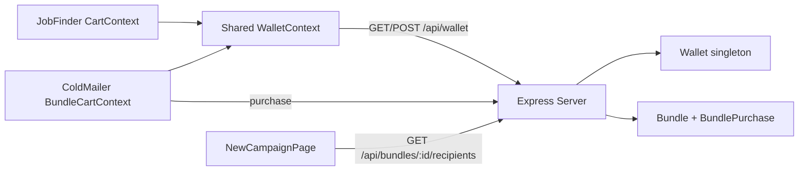

# HR Mail Marketplace for Cold Mailer

## Decisions locked in
- **Shared wallet**: one credits balance used by both Job Finder and Cold Mailer.
- **Real backend**: bundles, purchases, and the wallet live on the existing Express/Mongo server (`server/`), not frontend mocks.
- **Permanent ownership**: buying a bundle unlocks its contacts forever (no expiry, unlike Job Finder's 1-month subscriptions).
- **Campaign attach flow**: New Campaign gets a "Choose Source" step - Upload CSV **or** pick owned Bundle(s) - as alternatives, not merged.
- **Content seeding**: no admin UI yet (user will build one later). Ship one dummy seeded bundle via a script so the purchase/attach flow is demoable end-to-end.

## Why a real, shared backend wallet
Job Finder's wallet ([CartContext.jsx](src/pages/job-finder/CartContext.jsx)) is currently `localStorage`-only, and `jobFinderApi` points at a separate, never-built backend (`localhost:5002`). For credits to be genuinely shared, the wallet needs to live on the **existing Cold Mailer backend** (`server/`, port 5000) which already runs. Job Finder's checkout stays mocked (out of scope to rewrite), but its wallet balance will sync with this same real backend, with `localStorage` as an offline fallback (same `withMockFallback` pattern already used everywhere).



## Backend (`server/`)

New Mongoose models, mirroring the existing layered style ([campaigns.controller.js](server/controllers/campaigns.controller.js), [campaignService.js](server/services/campaignService.js)):

- **`server/models/Bundle.js`** - metadata is public; `recipients` (the real emails) is only ever selected server-side after a purchase check, never returned by list/detail endpoints.
```javascript
const bundleSchema = new mongoose.Schema({
  name: { type: String, required: true },
  category: { type: String, required: true },   // e.g. "Tech Recruiters"
  region: { type: String },
  description: { type: String },
  sampleTitles: [{ type: String }],              // teaser roles, no PII
  contactCount: { type: Number, required: true },
  creditCost: { type: Number, required: true },
  alaCartePrice: { type: Number, required: true },
  lastVerifiedAt: { type: Date },
  recipients: [{
    companyName: String,
    hrName: String,
    email: { type: String, required: true },
    role: String,
  }],
  createdAt: { type: Date, default: Date.now },
});
```
- **`server/models/BundlePurchase.js`** - `{ bundleId, paymentMethod: 'credits'|'alacarte', pricePaid, purchasedAt }`, used as the "do I own this" check and purchase history.
- **`server/models/Wallet.js`** - a **singleton** document (no auth/users in this app): `{ balance, transactions: [{ type: 'purchase'|'spend', description, credits, balanceAfter, source: 'job-finder'|'cold-mailer', date }] }`.
- **`server/config/creditPacks.js`** - single source of truth for buyable packs (`{ id, name, credits, price }[]`), replacing the frontend-only `mockCreditPacks`.

Services (per the "no loops/joins, atomic simple queries" rule):
- **`server/services/walletService.js`**: `getWallet()` (findOneAndUpdate upsert, single query), `addCredits(amount, description, source)` and `spendCredits(amount, description, source)` both as one atomic `findOneAndUpdate` (`spendCredits` conditions on `balance: { $gte: amount }` so insufficient funds fails the query itself, no read-then-write race).
- **`server/services/bundleService.js`**: `listBundles()` (select `-recipients`, one query for bundles + one query for all `BundlePurchase` ids to mark `purchased: true/false` - no per-item queries/joins), `getBundle(id)`, `listPurchasedBundles()`, `getBundleRecipients(id)` (403 via `httpError` if not purchased), `purchaseBundle(id, paymentMethod)` (blocks double-purchase, calls `walletService.spendCredits` when `paymentMethod === 'credits'`, else just records the sale, then creates the `BundlePurchase`).

Controllers + REST routes (matching existing conventions, `res.json({ data })`, `next(error)`):
- **`server/routes/bundles.routes.js`**: `GET /`, `GET /purchased`, `GET /:id`, `GET /:id/recipients`, `POST /:id/purchase`
- **`server/routes/wallet.routes.js`**: `GET /`, `GET /packs`, `POST /purchase` (body `{ packId }`)
- Mount both in [server/index.js](server/index.js) alongside the existing routes.
- **`server/seed/seedBundles.js`** + an npm `seed` script: inserts one dummy bundle (e.g. "SaaS Recruiters - India", 5 sample contacts, teaser titles only) so the flow works without an admin UI.

## Shared frontend wallet

- **`src/lib/apiHelpers.js`** (new): lift `withMockFallback`, `formatDate` out of [job-finder/helpers.js](src/pages/job-finder/helpers.js) so both tools share one implementation; `helpers.js` re-exports for zero breaking changes to existing Job Finder imports.
- **`src/context/WalletContext.jsx`** (new): `WalletProvider`/`useWallet()`. On mount, `GET /api/wallet` via a new `walletApi` (added to [src/lib/api.js](src/lib/api.js) using the **main `api` client**, same base URL as `coldMailerApi`, not the unused `jobFinderClient`); falls back to the last-known `localStorage` value if the request fails. `addCredits`/`spendCredits` call the backend then refresh.
- **`src/pages/job-finder/CartContext.jsx`**: refactor to source `wallet/addCredits/spendCredits` from `useWallet()` instead of owning that state; keeps its own `cart` (company items) local. External shape of `useCart()` is unchanged, so [JobFinderLayout.jsx](src/components/layout/JobFinderLayout.jsx), [WalletPage.jsx](src/pages/job-finder/WalletPage.jsx), [CheckoutPage.jsx](src/pages/job-finder/CheckoutPage.jsx) need no edits.
- **`src/App.jsx`**: mount `<WalletProvider>` once, above both the `job-finder` and `emailer` route subtrees.

## Cold Mailer marketplace UI (mirrors the Job Finder marketplace pattern, yellow/black accent to match Cold Mailer's existing "OUTREACH" theme)

- **`src/lib/api.js`**: add `bundlesApi` (`listBundles`, `getBundle`, `listPurchasedBundles`, `getBundleRecipients`, `purchaseBundle`) on the main `api` client.
- **`src/pages/cold-mailer/BundleCartContext.jsx`** (new): local `cart` of bundle items + `useWallet()` for balance/spend - same pattern as Job Finder's cart, kept as a separate cart instance since bundles and company-subscriptions are different products.
- **`src/components/cold-mailer/BundleProductCard.jsx`**: category badge, contact count, teaser chips from `sampleTitles` (never real emails), credit/à-la-carte price, Add to Cart / In Cart / Owned states - modeled on [CompanyProductCard.jsx](src/components/job-finder/CompanyProductCard.jsx).
- **`src/components/cold-mailer/BundleCartDrawer.jsx`**: slide-over, modeled on [CartDrawer.jsx](src/components/job-finder/CartDrawer.jsx).
- **`src/pages/cold-mailer/HrMarketplacePage.jsx`**: grid + search/category filter, modeled on [MarketplacePage.jsx](src/pages/job-finder/MarketplacePage.jsx).
- **`src/pages/cold-mailer/BundleCheckoutPage.jsx`**: credits vs à-la-carte selector, modeled on [CheckoutPage.jsx](src/pages/job-finder/CheckoutPage.jsx); on confirm, calls `bundlesApi.purchaseBundle` per cart item, clears cart, navigates to My Bundles.
- **`src/pages/cold-mailer/MyBundlesPage.jsx`**: owned bundles grid (contact count, purchase date) with a "Use in Campaign" button that navigates to `New Campaign` with the bundle pre-selected via router state.
- **`src/components/layout/ColdMailerLayout.jsx`**: add `HR MARKETPLACE` and `MY BUNDLES` sub-nav tabs, a credits chip, cart icon + `BundleCartDrawer` mount - mirrors [JobFinderLayout.jsx](src/components/layout/JobFinderLayout.jsx).

## Attaching a bundle to a campaign

**`src/pages/cold-mailer/NewCampaignPage.jsx`**: insert a new step 0, "Choose Source", before the current CSV upload step:
- **Upload CSV** -> existing 3-step flow unchanged (Upload -> Map & Clean -> Template & Launch).
- **Use Bundle(s)** -> fetch `bundlesApi.listPurchasedBundles()`, multi-select owned bundles, then `bundlesApi.getBundleRecipients(id)` for each selected (already shaped as `{ companyName, hrName, email, role }`, matching `recipientSchema`), merge into `recipients`, skip straight to Template & Launch (no mapping needed since data is already structured). If arriving from `MyBundlesPage`'s "Use in Campaign" with router state, pre-select that bundle and skip the source-choice screen entirely.
- No changes needed to [Campaign.js](server/models/Campaign.js) or the campaign create endpoint - `recipients` already accepts this exact shape regardless of source.

## Routing

Add to [src/App.jsx](src/App.jsx) under the existing `emailer` route:
- `emailer/marketplace` -> `HrMarketplacePage`
- `emailer/marketplace/checkout` -> `BundleCheckoutPage`
- `emailer/bundles` -> `MyBundlesPage`

## Todo breakdown
</plan>
<todos>[{"id": "backend-models", "content": "Create Bundle, BundlePurchase, Wallet models + creditPacks config"}, {"id": "backend-services", "content": "Build walletService (atomic add/spend) and bundleService (list/get/purchase/recipients)"}, {"id": "backend-routes", "content": "Add bundles and wallet controllers/routes, mount in server/index.js"}, {"id": "backend-seed", "content": "Add seed script with one dummy bundle"}, {"id": "shared-wallet-frontend", "content": "Extract apiHelpers.js, build WalletContext, refactor Job Finder CartContext to consume it, mount provider in App.jsx"}, {"id": "bundles-api-client", "content": "Add bundlesApi/walletApi to src/lib/api.js on the main api client"}, {"id": "bundle-cart", "content": "Build BundleCartContext, BundleProductCard, BundleCartDrawer"}, {"id": "marketplace-pages", "content": "Build HrMarketplacePage, BundleCheckoutPage, MyBundlesPage"}, {"id": "layout-routing", "content": "Update ColdMailerLayout nav/header and App.jsx routes"}, {"id": "campaign-attach", "content": "Add Choose Source step to NewCampaignPage for CSV vs Bundle recipients"}, {"id": "polish", "content": "Lint, build check, verify theme consistency"}]