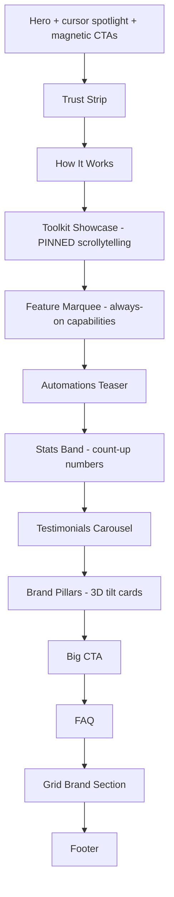

## Interactive Brochure Upgrade — Implementation Plan

### Current foundation (already in place)

The brochure page at [src/pages/LandingPage.jsx](src/pages/LandingPage.jsx) composes 10 sections from `src/pages/landing/*`, driven by GSAP + `ScrollTrigger` + `SplitText`, with Lenis smooth-scroll wired through [src/lib/lenisScroll.js](src/lib/lenisScroll.js) (custom `scrollerProxy` so ScrollTrigger and Lenis agree on scroll position). Reveal-on-scroll uses `ScrollTrigger.batch(...)` with `once: true`. This is the correct foundation to build on — no scroll library changes needed, only new GSAP timelines and new components.

### Confirmed scope (from user answers)

- Build the full pinned/scroll-jacked "Toolkit Showcase" (Apple product-page style, units.gr category-swap style) — the highest-effort, highest-impact piece.
- Use illustrative placeholder content for testimonials and any new stats, consistent with the existing Stats Band approach.

---

### 1. Toolkit Showcase — pinned scrollytelling (the core new piece)

Replaces [src/pages/landing/ToolkitDetail.jsx](src/pages/landing/ToolkitDetail.jsx) in the page composition (keep the old file or delete once replaced) with a new `src/pages/landing/ToolkitShowcase.jsx`.

**Mechanism (Apple-style pin + progress scrub):**
- One `section` with `min-height: 300vh` (three "chapters": Job Finder, Cold Mailer, Resume Maker), pinned via `ScrollTrigger.create({ pin: true, trigger: sectionRef, start: 'top top', end: '+=300%', scrub: 1 })`.
- Inside, a sticky visual panel (right side desktop / top on mobile) shows a mock product screen per chapter (reuse the existing bento-card + icon + feature-bullet visual language from the current `ToolkitDetail`, but as full-panel mockups rather than a 3-column grid).
- A left-side text column scrubs between 3 headline + bullet blocks as the pinned progress crosses 0%, 33%, 66% thresholds — driven by the same scroll timeline (`timeline.to(...)` at labeled progress points, or `onUpdate` swapping an `activeIndex` state via a small non-React DOM class toggle to avoid re-render thrash).
- A thin progress rail (3 tick marks) on the panel edge shows which chapter is active — mirrors units.gr's amenity category switcher and Apple's step indicators.
- On mobile (`<lg`), pinning is disabled (`matchMedia` via `ScrollTrigger.matchMedia`) and it falls back to the current stacked 3-panel grid layout (progressive enhancement, avoids janky pin behavior on small screens).

**Why this approach fits the existing code:** it reuses the same `gsap.context` + gsap.matchMedia pattern already imported in `LandingPage.jsx`, and the existing `refreshScrollTrigger()` call after mount (from `lenisScroll.js`) will keep pin measurements correct with Lenis.

---

### 2. Global interactive primitives (new small components/hooks)

| File | Purpose |
|---|---|
| `src/hooks/useCountUp.js` | Reusable hook: animates a number from 0 to target using `gsap.to` + `ScrollTrigger` (`once: true`), used by Stats Band. Respects `prefers-reduced-motion` (jumps straight to end value). |
| `src/hooks/useTilt.js` | Mouse-move 3D tilt hook (rotateX/rotateY based on cursor position within element bounds) applied to `bento-card` elements in Brand Pillars and Toolkit Showcase mockups. Disabled on touch devices (`window.matchMedia('(pointer: coarse)')`). |
| `src/components/interactive/MagneticButton.jsx` | Wraps a button/link; on mousemove within a radius, translates the element toward the cursor (magnetic pull), springs back with GSAP on mouseleave. Used on Hero CTAs and Big CTA. |
| `src/components/interactive/CustomCursor.jsx` | A small circular cursor-follower (GSAP `quickTo` for smooth lag) that scales up and inverts color when hovering `[data-cursor="hover"]` elements. Desktop-only (`pointer: fine` media check); falls back to the native cursor otherwise. Mounted once in `PublicLayout.jsx`. |
| `src/components/interactive/SectionDotNav.jsx` | Fixed right-edge vertical dot rail (Apple marketing-site pattern) with one dot per major section; active dot highlighted via `ScrollTrigger` on each section; click scrolls via Lenis (`lenis.scrollTo`). Hidden on mobile. |

All hooks/components respect `prefers-reduced-motion: reduce` by short-circuiting to static end states — required since several effects (tilt, magnetic, cursor) are purely cosmetic.

---

### 3. Feature Marquee (new section) — units.gr's second amenity strip equivalent

New `src/pages/landing/FeatureMarquee.jsx`, inserted after Toolkit Showcase. An infinite horizontal marquee (reusing the existing `.marquee-track` keyframe animation already in [src/index.css](src/index.css)) listing smaller "always-on" capabilities with icons: *Auto Follow-Ups · Real-Time Tracking · Secure Data Storage · One-Click Cancel · 24/7 Background Automation · No Lock-In*. Pauses on hover (`animation-play-state: paused` via `:hover` CSS, no JS needed).

---

### 4. Stats Band — count-up numbers

Update [src/pages/landing/StatsBand.jsx](src/pages/landing/StatsBand.jsx) to use `useCountUp` per stat, triggered once when the section scrolls into view, instead of static text. Numbers like `12,400+` animate digit-by-digit from `0`.

---

### 5. Testimonials Carousel (new, placeholder content)

New `src/pages/landing/TestimonialsSection.jsx`, inserted after Stats Band. Draggable/auto-advancing carousel (simple `useState` index + CSS transform, no new dependency) of 4-5 short illustrative fresher quotes in `bento-card` panels, clearly generic/placeholder in tone (e.g. "Landed 3 interviews in my first week using the auto-scanner." — Illustrative). Auto-advances every 5s, pauses on hover/drag, with dot pagination matching the `SectionDotNav` visual style.

---

### 6. Brand Pillars — 3D tilt

Apply `useTilt` to each `.brand-pillar` card in [src/pages/landing/BrandPillars.jsx](src/pages/landing/BrandPillars.jsx) for a subtle perspective tilt following the cursor, layered on top of the existing hover `scale` transform.

---

### 7. Hero — cursor spotlight + magnetic CTAs

In [src/pages/landing/HeroSection.jsx](src/pages/landing/HeroSection.jsx):
- Add a radial-gradient "spotlight" `div` that follows the mouse position within the hero section (GSAP `quickTo` on `background-position` or a transform on an absolutely-positioned glow layer), reinforcing depth like units.gr's soft imagery.
- Wrap both hero CTAs in `MagneticButton`.

---

### 8. Section dot navigation

Mount `SectionDotNav` in [src/components/layout/PublicLayout.jsx](src/components/layout/PublicLayout.jsx) (desktop only), listing: Home, How It Works, Toolkit, Stats, Stories, Why Us, FAQ. Each dot's active state driven by a lightweight `ScrollTrigger` per section (`start: 'top center', end: 'bottom center'`), avoiding re-renders by toggling a CSS class directly.

---

### 9. Custom cursor rollout

Mount `CustomCursor` once in `PublicLayout.jsx` (public marketing pages only, not the authenticated dashboard, to avoid affecting app UX). Interactive elements (`pill-btn`, `bento-card`, marquee items, testimonial cards) get `data-cursor="hover"` to trigger the enlarged cursor state.

---

### Technical notes

- All new pinned/scrub GSAP logic lives inside the existing `gsap.context(() => {...}, container)` block in `LandingPage.jsx` so it's auto-cleaned up on unmount via `ctx.revert()`, consistent with current code.
- Use `ScrollTrigger.matchMedia({ "(min-width: 1024px)": () => {...} })` to scope the pin behavior and cursor/tilt effects to desktop, with simpler fallbacks below that breakpoint — avoids scroll-jacking pain on mobile Safari/Chrome.
- No new dependencies required — GSAP, Framer Motion, and Lucide already cover every effect described (tilt, magnetic, count-up, carousel, marquee, pin).
- After adding the pinned section, re-verify `ScrollTrigger.refresh()` timing in `LandingPage.jsx` (already scheduled via `requestAnimationFrame` + `setTimeout`) since pinned sections are the most sensitive to premature measurement.

### Out of scope (flagged)
Real testimonial content/photos, real usage stats, a true image/video asset library (mockups stay CSS/SVG-based as today), and any changes to the authenticated dashboard's interaction model (cursor/tilt effects stay scoped to the public marketing pages).
