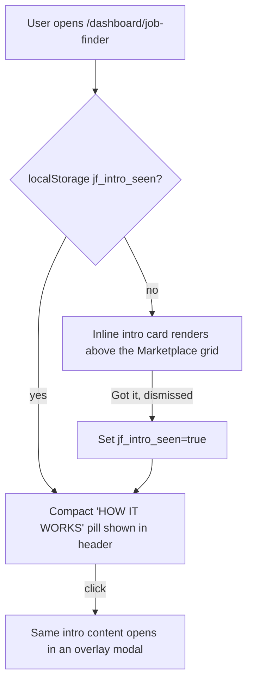

# Job Finder Intro Section

## Problem
Clicking "Job Finder" in [Sidebar.jsx](src/components/layout/Sidebar.jsx) drops the user straight onto [MarketplacePage.jsx](src/pages/job-finder/MarketplacePage.jsx) inside [JobFinderLayout.jsx](src/components/layout/JobFinderLayout.jsx), which only has a one-line tagline ("Subscribe to companies and get notified the moment a role fits you."). There's no explanation that a purchase grants exactly **30 days** of monitoring, or that matching is **automatic** against the user's Match Profile. units.gr's pattern of a headline + lede followed by an icon-labeled feature grid (its "Community living spaces / Ασφάλεια / Υποστήριξη / Smart Living" section) is a good structural model - adapted here as a 4-step process explainer instead of a static feature list, since Job Finder's story is sequential (browse then subscribe then wait then get notified).

## Behavior

- **First visit** (no `jf_intro_seen` in `localStorage`): the full intro renders inline at the top of [MarketplacePage.jsx](src/pages/job-finder/MarketplacePage.jsx), above the search/filter bar. A "Got it" button dismisses it and sets the flag.
- **Every visit after**: a small "HOW IT WORKS" pill sits in the [JobFinderLayout.jsx](src/components/layout/JobFinderLayout.jsx) header (next to the Wallet chip / notifications bell / cart icon), available on every Job Finder sub-page. Clicking it reopens the identical content in a modal overlay (same visual pattern as the existing [CartDrawer.jsx](src/components/job-finder/CartDrawer.jsx) backdrop).

## New files

- **`src/components/job-finder/JobFinderIntro.jsx`** - the shared content: headline, lede, and a 4-step grid (numbered `01`-`04`, icon, title, short copy), accepts an `onDismiss` (inline "Got it" mode) or is rendered plain inside a modal wrapper. Steps:
  1. **Browse Companies** (`Store` icon) - "Explore companies like Stripe, Vercel, and OpenAI. See open-role counts before you commit."
  2. **Subscribe Your Way** (`Wallet` icon) - "Pay with credits from your wallet, or go a-la-carte with a one-time payment. No recurring lock-in."
  3. **30 Days Of Coverage** (`Clock` icon) - "Every subscription actively watches that company's careers page for a full 30 days from purchase."
  4. **Matched & Notified** (`Bell` icon) - "New postings are checked against your Match Profile automatically - you only hear about real fits, the moment they're posted."
- **`src/components/job-finder/JobFinderIntroModal.jsx`** - `AnimatePresence` backdrop + panel wrapper (mirrors [CartDrawer.jsx](src/components/job-finder/CartDrawer.jsx) structure) that renders `JobFinderIntro` with a close (X) button.

## Edits

- **[src/pages/job-finder/helpers.js](src/pages/job-finder/helpers.js)**: add `hasSeenJobFinderIntro()` / `markJobFinderIntroSeen()` helpers wrapping the `jf_intro_seen` localStorage flag.
- **[src/pages/job-finder/MarketplacePage.jsx](src/pages/job-finder/MarketplacePage.jsx)**: on mount, check `hasSeenJobFinderIntro()`; if false, render `<JobFinderIntro onDismiss={...} />` above the existing search/filter bar; dismissing calls `markJobFinderIntroSeen()` and hides it (component-local state, no page reload needed).
- **[src/components/layout/JobFinderLayout.jsx](src/components/layout/JobFinderLayout.jsx)**: add an `Info`-icon "HOW IT WORKS" pill button in the header actions row (alongside the existing Wallet chip / `NotificationsBell` / cart button), managing `isIntroModalOpen` state and mounting `<JobFinderIntroModal>`.

## Visual style
Reuses existing primitives only - `bento-card`, `pill-badge`, `pill-btn`/`pill-btn-secondary`, `font-display` uppercase headline, blue/yellow accent colors - so it matches the current Job Finder theme exactly; no new CSS utilities needed.

## Todo breakdown
</plan>
<todos>[{"id": "intro-component", "content": "Build JobFinderIntro content component (headline, lede, 4-step grid)"}, {"id": "intro-modal", "content": "Build JobFinderIntroModal overlay wrapper"}, {"id": "helpers", "content": "Add hasSeenJobFinderIntro/markJobFinderIntroSeen to helpers.js"}, {"id": "marketplace-wire", "content": "Show inline intro on first visit in MarketplacePage, dismiss sets flag"}, {"id": "layout-pill", "content": "Add HOW IT WORKS pill to JobFinderLayout header, wire modal open/close"}, {"id": "polish", "content": "Lint and visual check across breakpoints"}]