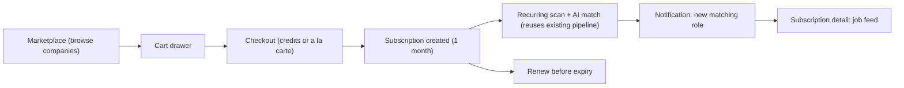
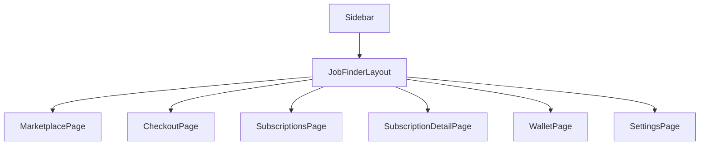

# Job Finder Marketplace Pivot

## 1. Business model recap

- Companies (Google, Amazon, etc.) are catalog "products" with a credit cost and an a-la-carte cash price.
- User buys **credit packs** (top-up wallet) or pays **a la carte** (card, skips credits) per company.
- Adding a company to cart + checking out creates a **Subscription**: 1 month of automatic monitoring of that company's career page, with AI match notifications when a new opening fits the user's profile.
- Credits never expire; only the **company subscription** expires after 1 month and must be renewed.
- This replaces the just-built manual "New Scan" / Campaigns flow entirely — the same underlying scan-and-match engine now runs automatically per active subscription instead of being manually triggered, and results surface as notifications instead of a one-off report.

## 2. New user flow

## 3. Route structure (replaces the current job-finder routes)

- `/dashboard/job-finder` (index) -> `MarketplacePage`
- `/dashboard/job-finder/checkout` -> `CheckoutPage`
- `/dashboard/job-finder/subscriptions` -> `SubscriptionsPage` ("My Subscriptions")
- `/dashboard/job-finder/subscriptions/:id` -> `SubscriptionDetailPage`
- `/dashboard/job-finder/wallet` -> `WalletPage`
- `/dashboard/job-finder/settings` -> `SettingsPage`

Cart is **not a route** — it's a slide-over drawer available from every page in the section, backed by shared context (see below). `Sidebar.jsx`'s single "Job Finder" entry is unchanged.

### Files removed (superseded by the new set)
`src/pages/job-finder/CampaignsListPage.jsx`, `NewCampaignPage.jsx`, `CampaignDetailPage.jsx`, `CompaniesPage.jsx`, `CompanyJobsPage.jsx` — the manual scan/company-CRUD model is fully replaced. `helpers.js` and `mockData.js` are substantially rewritten; `JobCard.jsx` and `ProgressPipeline.jsx` are kept and reused.

## 4. Shared state — `src/pages/job-finder/CartContext.jsx`

A React context (mounted once in `JobFinderLayout`, wrapping the `<Outlet />`) holds:
- `cart: Company[]` + `addToCart` / `removeFromCart` / `clearCart`
- `wallet: { balance, transactions[] }` + `spendCredits` / `addCredits`
- Persists to `localStorage` so cart/wallet survive navigation and refresh (still frontend-only, no backend)

This avoids prop-drilling cart/wallet state across Marketplace, the Cart drawer, Checkout, and the header chip.

## 5. Data model (mock entities in `mockData.js`)

- **Company**: `{ id, name, logoUrl, category, tier: 'standard'|'premium', openRoles, creditCost, alaCartePrice, description }`
- **CreditPack**: `{ id, name, credits, price, badge? }` — e.g. Starter (20 credits / $9.99), Growth (60 / $24.99, "BEST VALUE"), Pro (150 / $49.99)
- **Wallet.transactions**: `{ id, type: 'purchase'|'spend'|'refund', description, credits, date, balanceAfter }`
- **Subscription**: `{ id, companyId, status: 'active'|'expiring'|'expired'|'cancelled', purchasedAt, expiresAt, paymentMethod: 'credits'|'alacarte', newMatchesCount, lastScanAt, jobs[] }` (jobs reuse the existing Job shape: title, matchTier, matchScore, etc. from `mockJobs`)
- **Notification**: `{ id, subscriptionId, companyName, jobTitle, matchScore, createdAt, read }`
- **MatchProfile** (single, global, set once in Settings): `{ targetRoles, preferredLocation, experienceLevel, additionalRequirements }` — replaces the old per-campaign form; every subscription uses this one profile, so adding a company to cart requires no extra configuration (pure e-commerce "add to cart" simplicity).

## 6. `JobFinderLayout.jsx` changes

- Badge changes from `LIVE SCANNER` to `MARKETPLACE`; subtitle: "Subscribe to companies and get notified the moment a role fits you."
- Sub-nav pills become: `MARKETPLACE | SUBSCRIPTIONS | WALLET | SETTINGS`
- Header gains: a yellow credits chip (e.g. "42 CREDITS", links to Wallet) and a cart icon button with item-count badge (opens the `CartDrawer`), plus a `NotificationsBell`
- The old contextual "+ NEW SCAN" button is removed (no manual scan trigger anymore)

## 7. Pages

**`MarketplacePage`** (index) — search bar + category filter chips; grid of `CompanyProductCard` (new component): logo, name, tier badge (Premium = yellow, Standard = black/5), "N OPEN ROLES", price row (credits + a la carte), `Add to Cart` button that becomes `IN CART` (secondary, removable) or `SUBSCRIBED` (disabled black) if already active.

**`CartDrawer`** (`src/components/job-finder/CartDrawer.jsx`, slide-over, framer-motion) — line items with remove buttons, subtotal in credits, current/after-purchase balance (shortfall highlighted), `Proceed to Checkout` button; empty state with CTA back to Marketplace.

**`CheckoutPage`** — order summary table (company, 1 month, cost); payment method chooser: **Pay with Credits** (shows sufficiency) vs **Pay a la Carte** (simple mock card fields — clearly decorative, no real gateway); if credits insufficient, banner offers "Buy Credits" (-> Wallet) or switching the whole order to a la carte (no mixed per-item payment in v1, kept simple); Confirm & Pay creates `Subscription` records, deducts credits/logs transaction, clears cart, redirects to `SubscriptionsPage`.

**`WalletPage`** — balance hero (yellow-accented bento-card); 3 credit-pack cards (`Buy` button mock-adds balance + logs transaction + toast); transaction history table (date, description, credits +/-, running balance).

**`SubscriptionsPage`** ("My Subscriptions") — stat tiles (Active, New Matches This Week, Expiring Soon, Companies Watched); tabs Active / Expiring Soon / Expired; subscription cards with an expiry progress bar (blue -> yellow -> red as days remaining shrink), new-matches badge, `Renew` (prominent when <7 days left) and `Cancel` actions; empty state -> CTA to Marketplace.

**`SubscriptionDetailPage`** (`/subscriptions/:id`) — status/expiry header with Renew/Cancel; reused `ProgressPipeline` showing the latest scan cycle; job feed tabs (New Matches / All Time / Saved) reusing `JobCard`; side panel with subscription metadata (purchased date, payment method, price paid).

**`NotificationsBell`** (`src/components/job-finder/NotificationsBell.jsx`, header dropdown, not a route) — unread-count badge, list of recent match notifications, "Mark all read", click-through to `SubscriptionDetailPage`.

**`SettingsPage`** (kept, restructured) — new top section "Match Profile" (target roles, location, experience level, additional instructions) applied globally to all subscriptions; existing Groq/SMTP section reframed as "Notification Delivery" with an email digest frequency option (Instant / Daily / Weekly).

## 8. Reused as-is

`JobCard.jsx`, `ProgressPipeline.jsx` (relabel steps if helpful, e.g. Watching -> Scanning -> Matching -> Notified), and helper utilities `formatDate`, `exportJobsToCsv` from `helpers.js` (still useful for exporting a subscription's matched jobs).

## 9. API surface (mock-first, matching future backend shape)

Extend `jobFinderApi` in `src/lib/api.js` with: `listMarketplaceCompanies`, `getWallet`, `purchaseCreditPack`, `checkout(cartItems, paymentMethod)`, `listSubscriptions`, `getSubscription`, `renewSubscription`, `cancelSubscription`, `listNotifications`, `markNotificationRead`. Every call falls back to mock data via the existing `withMockFallback` helper, so the section works standalone with no backend running (consistent with the current setup).

## 10. Out of scope

Real payment gateway integration, mixed per-item payment methods in one order, credit expiry, auto-renewal, multi-currency pricing, admin curation UI for the company catalog (catalog is a static mock list for now).
