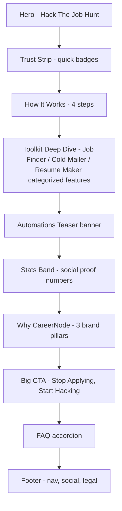

## Improving the Intro (Landing) Page

### Current state

The public intro page is [src/pages/LandingPage.jsx](src/pages/LandingPage.jsx), rendered via [src/components/layout/PublicLayout.jsx](src/components/layout/PublicLayout.jsx) at route `/`. Today it has exactly 3 sections: a Hero, a 3-card "Toolkit" grid, and a big black CTA banner. There is no footer, no "how it works," no social proof, no FAQ, and each tool gets only a one-line description.

units.gr's brochure structure is much richer: hero -> convenience/amenity icon strip -> categorized amenity breakdown ("All-Inclusive Living" split into Community/Security/Support/Smart Living, each with bullet lists) -> a second icon strip -> product intro with CTA -> community/lifestyle section -> brand-values pillars -> footer with FAQs, social, legal links.

### Confirmed scope (from user answers)

- "Proper brochure page" - a detailed marketing page fully explaining what CareerNode offers, before the dashboard.
- Full rebuild with many new sections (not just expanding the existing 3).
- Each of the 3 tools gets a detailed sub-feature breakdown with icons (like units.gr's amenity grids), not a single card.

### Goal

Rebuild `LandingPage.jsx` using that structure, with copy grounded in what CareerNode actually does (Job Finder marketplace, Cold Mailer/HR bundles, Resume Maker, Automations), reusing existing design tokens (`--color-accent-blue`, `--color-accent-yellow`, `bento-card`, `pill-btn`, `pill-badge`, `text-fluid-*`) — no new visual language, just far more depth.

### Section-by-section content plan

**1. Hero (enhance existing)**
Keep the current GSAP `SplitText` headline animation. Add a secondary "See How It Works" ghost CTA (`pill-btn-secondary`) next to "Get Early Access" that anchor-scrolls to the How It Works section.

**2. Trust Strip (new)**
Row of icon+label chips beneath the hero: *No Credit Card Required · Free To Start · Built For Freshers · Setup In 5 Minutes*. Reuses the existing floating-badge visual style as a static row.

**3. How It Works (new)**
4-step horizontal timeline (numbered via `pill-badge` "01/02/03/04" like the existing Toolkit cards): **Sign Up -> Auto-Scan & Match -> AI Tailors Resume + Outreach -> Track & Land the Offer**. Each step: short description + icon.

**4. Toolkit Deep Dive (rebuild - the core of this plan)**
Replaces the 3 shallow cards with 3 detailed, categorized panels modeled on units.gr's amenity breakdown (icon + heading + bullet sub-list per category). Reuses the `grid grid-cols-1 md:grid-cols-3 divide-y md:divide-y-0 md:divide-x` pattern already established in [src/pages/automations/ComingSoonPage.jsx](src/pages/automations/ComingSoonPage.jsx).

- Job Finder: Live career-page scanning, AI match scoring, Credit-based a la carte unlocks, 30-day auto-renewing subscriptions (grounded in [src/pages/job-finder/MarketplacePage.jsx](src/pages/job-finder/MarketplacePage.jsx), [src/pages/job-finder/WalletPage.jsx](src/pages/job-finder/WalletPage.jsx), [src/pages/job-finder/SubscriptionsPage.jsx](src/pages/job-finder/SubscriptionsPage.jsx))
- Cold Mailer: Verified HR contact bundles, AI-drafted outreach emails, Campaign tracking, Wallet-based credits (grounded in [src/pages/cold-mailer/HrMarketplacePage.jsx](src/pages/cold-mailer/HrMarketplacePage.jsx), [src/pages/cold-mailer/NewCampaignPage.jsx](src/pages/cold-mailer/NewCampaignPage.jsx))
- Resume Maker: Upload base resume, Paste job description, AI ATS-keyword tailoring, Instant PDF/DOCX export (grounded in [src/pages/ResumeMakerPage.jsx](src/pages/ResumeMakerPage.jsx))

Each panel is a `bento-card` with a big icon (`Search`/`Mail`/`FileText`), title, and 3-4 bullet rows (icon + short label).

**5. Automations Teaser banner (new, small)**
Slim yellow-accented strip: "Coming Soon: Visual Automations - wire Job Finder -> Resume Maker -> Cold Mailer into one flow." Links to `/dashboard/automations`, reusing the `Workflow` icon and `COMING SOON` pill pattern already in [src/pages/DashboardPage.jsx](src/pages/DashboardPage.jsx).

**6. Stats Band (new)**
Bold numeric strip with illustrative product stats: *12,400+ Jobs Auto-Scanned · 3.2x Faster Replies · 85% Avg ATS Match · 500+ Freshers Onboarded*. Marked in code as placeholder copy for now.

**7. Why CareerNode - brand pillars (new)**
3-column section mirroring units.gr's brand-values section: **Built For Freshers** (no jargon, made for first job hunts) · **Automation, Not Noise** (systems that work quietly in the background) · **We've Got Your Back** (support, transparent pricing, no lock-in).

**8. Big CTA (keep as-is)**
Existing "STOP APPLYING. START HACKING." section stays unchanged.

**9. FAQ accordion (new)**
5-6 Q&As in `bento-card` accordions (simple `useState` expand/collapse, no new dependency): What is CareerNode? Is it free to start? What are credits? Do I need an existing resume? Is my data safe? Can I cancel a subscription anytime?

**10. Footer (new - currently missing entirely)**
New `PublicFooter` component mounted in [src/components/layout/PublicLayout.jsx](src/components/layout/PublicLayout.jsx) after `<Outlet/>`: logo, 3 nav columns (Product: Job Finder/Cold Mailer/Resume Maker/Automations; Company: About/FAQ/Contact; Legal: Privacy/Terms), social icons row, copyright line.

### Technical implementation

- Split the page into smaller components under a new `src/pages/landing/` folder: `HeroSection.jsx`, `TrustStrip.jsx`, `HowItWorks.jsx`, `ToolkitDetail.jsx`, `AutomationsTeaser.jsx`, `StatsBand.jsx`, `BrandPillars.jsx`, `BigCta.jsx`, `FaqSection.jsx`. `LandingPage.jsx` becomes a thin composition of these, keeping the single `gsap.context` ref for shared scroll-trigger setup.
- New file: `src/components/layout/PublicFooter.jsx`, imported into [PublicLayout.jsx](src/components/layout/PublicLayout.jsx).
- Reuse existing GSAP infra ([src/lib/gsap.js](src/lib/gsap.js), `ScrollTrigger`) for reveal animations on each new section, following the `.toolkit-card` stagger pattern already in the file.
- No new design tokens - strictly reuse `--color-accent-blue`, `--color-accent-yellow`, `bento-card`, `pill-btn`, `pill-btn-secondary`, `pill-badge`, `text-fluid-hero/h2/h3` from [src/index.css](src/index.css).
- New `lucide-react` icons needed (already a dependency): `Zap`, `ShieldCheck`, `Users`, `Clock`, `BarChart3`, `ChevronDown` (FAQ toggle), `Instagram`/`Linkedin`/`Twitter` (footer socials).
- No backend or routing changes - purely a content/component rebuild of the existing public `/` route.

### Out of scope (flagged, not building now)

Real analytics wiring for the Stats Band, a role-selection flow (fresher vs recruiter), and true testimonials (would need a testimonials data source).
