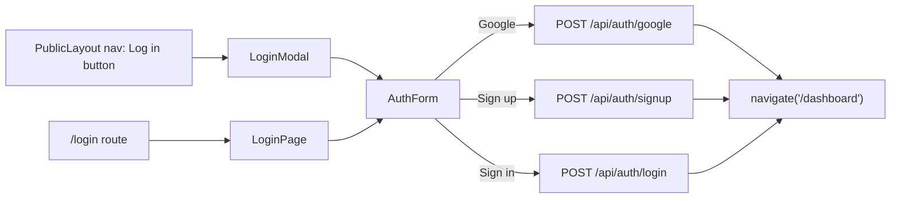

## Scope

**In scope:** Redesigned `/login` page, a reusable `LoginModal`, a shared `AuthForm` (Google + email/password, sign-in/sign-up), backend `signup`/`login` endpoints so email/password actually works, fixing the existing hardcoded API URL bug.

**Explicitly out of scope (per your answer):** `AuthContext`, protected `/dashboard` routes, nav/sidebar reflecting logged-in state, logout, `/me` endpoint, forgot-password flow (shown as a disabled "coming soon" link only). These can be a follow-up once this UI lands.

## Current state (relevant findings)

- [src/pages/auth/LoginPage.jsx](src/pages/auth/LoginPage.jsx) already has a working Google button via `useGoogleLogin`, but POSTs to a **hardcoded** `http://localhost:5000/api/auth/google` instead of the shared [src/lib/api.js](src/lib/api.js) client.
- Backend has `POST /api/auth/google` only ([server/controllers/auth.controller.js](server/controllers/auth.controller.js), [server/routes/auth.routes.js](server/routes/auth.routes.js)). `User` model ([server/models/User.js](server/models/User.js)) requires `googleId`, has no password field.
- No modal/tab component exists for auth; best pattern to reuse is [src/components/job-finder/JobFinderIntroModal.jsx](src/components/job-finder/JobFinderIntroModal.jsx) (backdrop + spring-in centered card + close button).
- Design tokens: sand-beige `--color-background`, `bento-card`, `pill-btn`, `bento-button` (already used for the Google button), `font-display` lowercase wordmark + pentagon `HouseIcon` (used in splash/footer/GridBrandSection) as the recurring brand mark.

## UI/UX design

### Shared `AuthForm` (new: `src/components/auth/AuthForm.jsx`)
One component rendered by both the page and the modal, so behavior stays identical:

- **Mode switch**: two-pill segmented control "Sign in" / "Create account" (visually modeled on the insider toggle in [ComingSoonPage.jsx](src/pages/automations/ComingSoonPage.jsx)) with a sliding black indicator.
- **Fields**:
  - Sign in: Email, Password, right-aligned "Forgot password?" (disabled/tooltip "Coming soon" — no backend for this yet).
  - Create account: Name, Email, Password, Confirm password.
  - Inputs styled like the dashboard settings pattern: `bg-black/5 border border-black/10 rounded-[16px] px-4 py-3 focus:ring-2 focus:ring-[var(--color-accent-blue)]`.
  - Password fields get a show/hide eye-icon toggle (lucide `Eye`/`EyeOff`).
- **Inline validation**: invalid email format, password `< 8` chars, confirm-password mismatch, required-field blanks — small red helper text under each field, red border on the input.
- **Submit button**: full-width `pill-btn`, label swaps with mode, `Loader2` spinner + disabled state while submitting (also disables the Google button, and vice versa).
- **Divider**: "or" between two hairlines.
- **Google button**: reuses the existing `bento-button` + Google "G" SVG from the current `LoginPage`, wired through `useGoogleLogin` as today, but posting through the fixed API client.
- **Error banner**: reuse the existing `bg-red-50 text-red-600 border border-red-100` box for server errors ("Invalid credentials", "Email already in use", etc).
- **Footer**: mode-switch text link + the existing Terms/Privacy fine print.
- On success (Google or email): store `cn_token` (and now also `cn_user` JSON, so it's ready for a future `AuthContext` to hydrate from) in `localStorage`, `navigate('/dashboard')` — matching today's behavior, no new global state.

### Redesigned full page — `src/pages/auth/LoginPage.jsx`
Split layout on `lg:` breakpoints:

- **Left brand panel** (~45%, hidden below `lg`, collapses to a slim top strip on mobile): dark panel reusing the `grid-brand-bg` pixel motif from [GridBrandSection.jsx](src/pages/landing/GridBrandSection.jsx), vertically centered "career node" wordmark + `HouseIcon` pentagon, tagline "Hack the job hunt.", and 3 stacked value-prop pills with checkmarks (AI-matched job scans / Cold email automation / ATS-ready resumes).
- **Right panel**: centered `bento-card` containing `<AuthForm />`, "Back to home" link top-left (kept from current page).

### Reusable modal — `src/components/auth/LoginModal.jsx` (new)
- Same backdrop/spring/close-button structure as `JobFinderIntroModal`.
- Compact single-column `bento-card` (max-w-md), small wordmark+pentagon header, then `<AuthForm />` — no split brand panel (keeps the modal light).

### Nav trigger — `src/components/layout/PublicLayout.jsx`
- Add a plain "Log in" text/ghost button between the logo and the existing DASHBOARD CTA, toggling local `useState` to open `<LoginModal />` (mounted once in the layout). DASHBOARD CTA stays as-is since route gating is out of scope.



## Backend changes (needed to make email/password real, not just UI)

- [server/models/User.js](server/models/User.js): make `googleId` optional+sparse (not `required`), add `passwordHash: String` (optional — absent for Google-only accounts).
- `server/package.json`: add `bcryptjs`.
- [server/controllers/auth.controller.js](server/controllers/auth.controller.js): extract a small `signToken(user)` helper (dedupe from `googleLogin`); add:
  - `signup` — validates body, checks existing email, hashes password with `bcryptjs`, creates `User` + `Wallet` (matching the existing Google flow's wallet bootstrap), returns `{ token, user }`.
  - `login` — finds by email, `bcrypt.compare`, returns `{ token, user }` or `401`.
- [server/routes/auth.routes.js](server/routes/auth.routes.js): add `POST /signup`, `POST /login`.
- [server/.env.example](server/.env.example): document `GOOGLE_CLIENT_ID`, `JWT_SECRET` (currently used in code but undocumented).
- Root `.env.example`: document `VITE_GOOGLE_CLIENT_ID`.

## Frontend API client fix

- [src/lib/api.js](src/lib/api.js): add an `authApi` object:
  ```js
  export const authApi = {
    google: (token) => api.postJson('/auth/google', { token }),
    login: (body) => api.postJson('/auth/login', body),
    signup: (body) => api.postJson('/auth/signup', body),
  };
  ```
- `AuthForm` uses `authApi.*` instead of the current hardcoded `fetch('http://localhost:5000/...')`, fixing the existing bug as a side effect.

## Notes / boundaries
- No changes to `/dashboard` route guarding, `Sidebar` user card, or `PublicLayout`'s DASHBOARD CTA behavior in this pass.
- Forgot-password link is present but disabled (styled, non-functional) to signal it's coming, without scope-creeping into email delivery.
