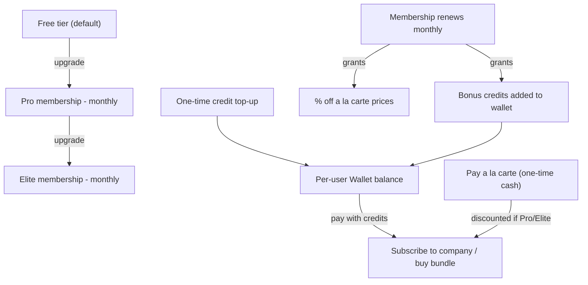

## Current state (why this is needed)

- **Wallet is a global singleton today**, not per-user: [`server/services/walletService.js`](server/services/walletService.js) uses one hardcoded `WALLET_ID` for the entire app. Every user shares one balance. This must be fixed first or per-user memberships/credits are meaningless.
- **No real payment gateway anywhere.** [`wallet.controller.js`](server/controllers/wallet.controller.js) line 32 says "In a real app, charge the credit card here via Stripe/Razorpay... We assume payment was successful." [`CheckoutPage.jsx`](src/pages/job-finder/CheckoutPage.jsx) has a disabled fake card input and literally states "Mock checkout environment."
- **No recurring billing exists.** [`Subscription.js`](server/models/Subscription.js) has `expiresAt` but nothing renews it — [`CheckoutPage.jsx`](src/pages/job-finder/CheckoutPage.jsx) line 206 explicitly tells users "Subscriptions do not auto-renew."
- **Two pricing mechanisms already exist per-item**: `creditCost` vs `alaCartePrice` on both [`Company.js`](server/models/Company.js) (Job Finder) and [`Bundle.js`](server/models/Bundle.js) (Cold Mailer) — this plan adds a third layer (platform Membership) on top of these, not a replacement.
- **No platform membership tiers exist.** The "FREE PLAN" pill in [`UserMenu.jsx`](src/components/layout/UserMenu.jsx) is hardcoded and does nothing.
- Per your answer: **focus on frontend/UX and the full data model + flows now**; real money movement stays a mocked internal ledger behind a `paymentService` abstraction so Cashfree can be dropped in later with minimal rework.

## Business model

Three ways money/credits flow into a user's account, all feeding the same "spend" actions (subscribe to a company, buy an HR bundle):



- **Free** — default on signup. Standard a la carte pricing. No monthly bonus credits. Limited to 1 concurrent Job Finder company subscription (creates a natural upgrade trigger).
- **Pro** (monthly) — e.g. 200 bonus credits granted every renewal, 15% off all a la carte prices, up to 5 concurrent subscriptions, "PRO" badge in nav (already has a badge slot in `UserMenu.jsx`).
- **Elite** (monthly) — larger bonus credit grant, 30% off a la carte, unlimited concurrent subscriptions, early access to premium companies.

Admin defines/edits these tiers (mirrors the existing [`AdminCreditPacksPage.jsx`](src/pages/admin/AdminCreditPacksPage.jsx) CRUD pattern) so pricing can change without a deploy.

---

## Phase 0 — Fix Wallet to be per-user (foundational, blocking)

- [`server/models/Wallet.js`](server/models/Wallet.js): add `userId: { type: ObjectId, ref: 'User', required: true, unique: true }`, remove singleton assumption.
- [`server/services/walletService.js`](server/services/walletService.js): every function (`getWallet`, `addCredits`, `spendCredits`) takes `userId` instead of using the hardcoded `WALLET_ID`; use `findOneAndUpdate({ userId }, ..., { upsert: true })`.
- [`server/controllers/wallet.controller.js`](server/controllers/wallet.controller.js): pull `req.user._id` (from `requireAuth`).
- [`server/routes/wallet.routes.js`](server/routes/wallet.routes.js): currently has **no auth middleware at all** — add `requireAuth` to every route.
- [`server/services/bundleService.js`](server/services/bundleService.js) `purchaseBundle`, and Job Finder checkout flow: pass `userId` through.
- Frontend `WalletContext`/`CartContext` ([`src/pages/job-finder/CartContext.jsx`](src/pages/job-finder/CartContext.jsx)) — no shape change needed, just now returns the caller's own wallet since the API is user-scoped.
- [`server/controllers/admin.controller.js`](server/controllers/admin.controller.js) `listTransactions` — join wallet transactions back to `User.email` via `userId` (fixes the "Wallet ID" placeholder column already noted in the admin transactions table).
- Migration note: existing signup/google-login wallet creation in `auth.controller.js` already creates one `Wallet` per user on signup (just with the wrong/missing `userId` field today) — align it to the new schema.

---

## Phase 1 — Data models

**New model** `server/models/MembershipPlan.js` (admin-managed, mirrors `CreditPack.js`):
```javascript
{
  name, tier: { type: String, enum: ['free','pro','elite'], unique: true },
  monthlyPrice, monthlyBonusCredits, alaCarteDiscountPercent,
  maxActiveSubscriptions: { type: Number, default: null }, // null = unlimited
  perks: [String], badge, isActive
}
```

**New model** `server/models/UserMembership.js`:
```javascript
{
  userId: { ref: 'User', unique: true },
  planId: { ref: 'MembershipPlan' },
  status: { enum: ['active','cancelled','past_due'] },
  renewsAt: Date,
  cancelAtPeriodEnd: { type: Boolean, default: false },
  paymentProviderRef: { type: String, default: null } // reserved for Cashfree subscription id later
}
```

**Extend** [`server/models/Wallet.js`](server/models/Wallet.js) transaction `source` enum to add `'membership'`.

**Seed script** `server/seed/seedMembershipPlans.js` (idempotent, following the pattern fixed in `seedCompanies.js`) creating Free/Pro/Elite; every existing/new user gets a `UserMembership` on the Free plan by default (set at signup in `auth.controller.js`).

---

## Phase 2 — Payment abstraction (frontend-first, Cashfree-ready)

New `server/services/paymentService.js`:
```javascript
async function chargeOneTime({ userId, amount, description }) { /* mock: always succeeds today */ }
async function createRecurringMandate({ userId, planId }) { /* mock: returns a fake providerRef today */ }
async function cancelRecurringMandate({ providerRef }) { /* mock: no-op today */ }
```
Every call site that "charges money" (top-up purchase, a la carte checkout, membership subscribe) goes through this file with a `// TODO: CASHFREE — replace with Order/Subscription API call` marker, so later you swap internals only here — no changes needed elsewhere when Cashfree is added.

---

## Phase 3 — Monthly renewal (simulated, no real charge yet)

New `server/services/membershipRenewalJob.js`, run at boot via `setInterval`, matching the existing in-process pattern used by `campaignService` in [`server/index.js`](server/index.js):
- Daily tick: find `UserMembership` where `renewsAt <= now` and `status === 'active'`
- If `cancelAtPeriodEnd`, downgrade to Free plan instead of renewing
- Else: call `paymentService.chargeOneTime(...)` (mocked), grant `monthlyBonusCredits` via `walletService.addCredits(userId, amount, 'Monthly Pro membership renewal', 'membership')`, advance `renewsAt` by 1 month

---

## Phase 4 — Backend endpoints

New `server/routes/membership.routes.js` mounted at `/api/membership`:
- `GET /plans` — public, list active `MembershipPlan`s (mirrors [`marketplace.routes.js`](server/routes/marketplace.routes.js) pattern)
- `GET /me` — `requireAuth`, current user's plan + `renewsAt` + `cancelAtPeriodEnd`
- `POST /subscribe` `{ planId }` — `requireAuth`, calls `paymentService.createRecurringMandate`, upserts `UserMembership`, immediately grants first month's bonus credits
- `POST /cancel` — `requireAuth`, sets `cancelAtPeriodEnd: true` (stays active until `renewsAt`, standard SaaS pattern)

Admin CRUD for `MembershipPlan` in [`server/routes/admin.routes.js`](server/routes/admin.routes.js) / [`server/controllers/admin.controller.js`](server/controllers/admin.controller.js), following the exact list/create/update/delete pattern already used for `CreditPack`.

---

## Phase 5 — Core conversion surface: Membership/Pricing pages

**In-app**: new `src/pages/billing/MembershipPage.jsx` at `/dashboard/billing` (shared route since wallet/membership are shared across Job Finder + Cold Mailer). Three-column plan cards (reusing the existing pack-card visual language from [`WalletPage.jsx`](src/pages/job-finder/WalletPage.jsx) lines 64-93), "MOST POPULAR" badge on Pro, checklist of perks, current-plan indicator, "Cancel membership" action for paid tiers.

**Public marketing**: new `src/pages/PricingPage.jsx` at `/pricing`, same visual cards, linked from [`PublicLayout.jsx`](src/components/layout/PublicLayout.jsx) nav. CTA routes unauthenticated visitors to `/login`, authenticated users to `/dashboard/billing`. (This is the page that converts new visitors — landing pages without visible pricing measurably lose signups.)

---

## Phase 6 — Wire CTAs at the highest-intent moments

Ranked by expected conversion impact:

1. **Checkout friction point (highest intent)** — [`CheckoutPage.jsx`](src/pages/job-finder/CheckoutPage.jsx) lines 139-148 and the Cold Mailer equivalent `BundleCheckoutPage.jsx`: the existing "Insufficient Credits" warning box gets a second CTA next to "TOP UP WALLET": **"Save {discount}% — Upgrade to Pro"** linking to `/dashboard/billing`. This is the single best upsell moment — the user has already decided to pay and hit a wall.
2. **Wallet page** — [`WalletPage.jsx`](src/pages/job-finder/WalletPage.jsx): add a membership upsell banner directly above the "Buy Credits" grid (line 59) — user is already in a spending mindset.
3. **Always-visible nav pill** — [`UserMenu.jsx`](src/components/layout/UserMenu.jsx) line 92: make the "FREE PLAN" pill clickable (routes to `/dashboard/billing`) and show the real plan name/tier color from `/membership/me` instead of the hardcoded string. Seen on every page, every session.
4. **Dashboard home** — [`DashboardPage.jsx`](src/pages/DashboardPage.jsx): add a 5th bento tile (matching the existing Job Finder/Cold Mailer/Resume Maker/Automations grid pattern, lines 56-154) showing current plan with an "Upgrade" CTA for Free users — first thing seen post-login.
5. **Product cards** — [`CompanyProductCard.jsx`](src/components/job-finder/CompanyProductCard.jsx) and the Cold Mailer bundle card: small "Pro members save {discount}%" micro-badge on premium-tier items, planting the idea before the user even adds to cart.
6. **Low-balance nudge** — a slim dismissible banner in [`JobFinderLayout.jsx`](src/components/layout/JobFinderLayout.jsx) / `ColdMailerLayout.jsx` headers when wallet balance drops below a threshold (e.g. 10 credits), prompting top-up or upgrade.
7. **Post-purchase moment** — after a successful a la carte checkout, a toast/modal: "You could have saved ${amount} with Pro — Upgrade now" — capturing the user right after they've proven willingness to pay cash.

---

## Phase 7 — Apply membership discount to a la carte pricing

[`CheckoutPage.jsx`](src/pages/job-finder/CheckoutPage.jsx) and `BundleCheckoutPage.jsx`: fetch the current user's `alaCarteDiscountPercent` from `/membership/me` and apply it to the displayed/charged `alaCartePrice` total when `paymentMethod === 'alacarte'`.

---

## Out of scope (explicitly deferred per your answer)

- Real Cashfree integration (Order API, Subscription/mandate API, webhooks for payment confirmation and renewal failure handling) — the `paymentService.js` abstraction and `paymentProviderRef` fields are the seams left for this
- Dunning/retry logic for failed recurring charges
- Proration when switching plans mid-cycle
- Multi-currency pricing
- Public landing page pricing section beyond the standalone `/pricing` page (can reuse the same component later)

---

## Verification checklist

1. Two different logged-in users have independent wallet balances (Phase 0 fix)
2. Signing up grants a Free `UserMembership` automatically
3. `/dashboard/billing` shows 3 plans, current plan highlighted
4. Subscribing to Pro immediately grants bonus credits and updates the nav pill
5. Simulated renewal job (can be manually triggered for testing) grants monthly credits and advances `renewsAt`
6. Cancelling keeps Pro active until `renewsAt`, then reverts to Free
7. Checkout with insufficient credits shows both "Top Up" and "Upgrade to Pro" CTAs
8. A la carte checkout total reflects the logged-in user's membership discount
