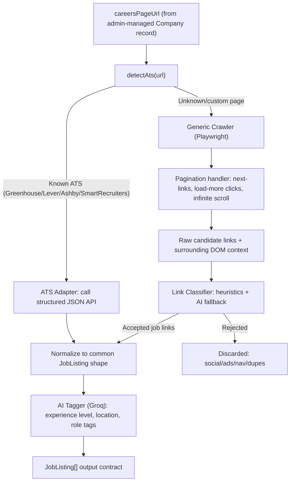

## Context

Investigation confirmed Job Finder is currently **frontend-only mock data** — there is no `Company`/`Job` DB schema, no scraper, no admin panel, and no scheduler in the repo (see `src/pages/job-finder/mockData.js`, `server/`). Per your scope choice, this plan covers **only the scraper/extraction engine** as a standalone backend service module. It is designed so a future admin panel, DB schema, and cron scheduler (separate work) can call a single clean entry point without needing to know scraping internals.

## Architecture



## 1. ATS adapter layer (preferred path — most reliable, no browser needed)

New folder: `server/services/scraper/atsAdapters/`

Detect known ATS platforms from the careers URL and pull jobs directly from their public, unauthenticated JSON feeds instead of parsing HTML:

- **Greenhouse**: `boards-api.greenhouse.io/v1/boards/{token}/jobs?content=true` — token parsed from `boards.greenhouse.io/{token}/...` or `job-boards.eu.greenhouse.io/{token}/...`
- **Lever**: `api.lever.co/v0/postings/{token}?mode=json` (retry `api.eu.lever.co` on 404) — token from `jobs.lever.co/{token}/...`
- **Ashby**: `api.ashbyhq.com/posting-api/job-board/{token}` — token from `jobs.ashbyhq.com/{token}/...`
- **SmartRecruiters**: `api.smartrecruiters.com/v1/companies/{token}/postings` — token from `careers.smartrecruiters.com/{token}/...`

Each adapter file exports `{ matches(url), fetchJobs(url) }`. `atsAdapters/index.js` holds the registry and `detectAts(url)` iterates adapters' `matches()`.

Because these are official JSON feeds, pagination/lazy-loading/junk-link problems **do not apply here** — this path should cover the majority of tech company career pages and is the most robust option, so it's tried first.

## 2. Generic crawler fallback (for custom/non-ATS career pages)

New file: `server/services/scraper/genericCrawler.js`, using **Playwright** (added to `server/package.json`) since it can execute JS, wait for network idle, and drive a real Chromium instance — required to handle lazy-loaded/JS-rendered listings that a plain HTTP+HTML-parser approach (e.g. axios+cheerio) cannot.

Robustness measures:
- **Pagination detection**: look for `rel="next"` links, common "Next"/page-number patterns, and URL query patterns (`?page=`, `?offset=`); follow up to a configurable `maxPages` safety cap.
- **"Load more" buttons**: detect buttons/links matching text patterns (`/load more|show more|view more/i`), click and wait for new DOM nodes, loop until no new items appear or a max-click cap is hit.
- **Infinite scroll**: scroll to bottom, wait for `networkidle`/new nodes via `MutationObserver` injection, repeat until listing count stabilizes across two consecutive scrolls or a max-iteration cap is hit.
- **Politeness/stability**: per-domain concurrency limit (reuse a single browser instance, one page per company scan), request timeout + retry with backoff, custom User-Agent, and a hard per-scan time budget so one broken page can't hang the whole run.
- Output of this stage: a deduped list of `{ href, linkText, surroundingText }` candidates gathered from anchor tags found within the page (not yet filtered).

## 3. Link classification ("only job links")

New file: `server/services/scraper/linkClassifier.js` — a two-stage filter so most junk is rejected cheaply before any AI call:

**Stage 1 — heuristic rejection (no network/AI cost):**
- Reject non-http(s) links (`mailto:`, `tel:`, `javascript:`, `#`-only anchors).
- Reject known junk domains/patterns: social networks (facebook/twitter/x/linkedin/instagram share links), ad/tracking params (`utm_`, `doubleclick`, `googletagmanager`), and same-site nav links (privacy, terms, blog, about) matched via a small denylist of path keywords.
- Reject links pointing off the company's own domain and known ATS domains (i.e. not a plausible job posting host).

**Stage 2 — heuristic acceptance / AI tiebreaker (for ambiguous links only):**
- Auto-accept links whose path or link text strongly matches job-posting patterns (`/job|career|position|opening|req-?\d+/i` in the URL path, or the link sits inside a repeated DOM structure that looks like a job list).
- For links that are ambiguous after heuristics, batch them (reusing the chunking pattern already used in `server/services/aiService.js`'s `cleanData`) and send `{ href, linkText, surroundingText }` to Groq with a strict prompt asking "is this a link to a specific job posting? yes/no", returning only accepted links. This keeps AI calls limited to the genuinely unclear cases, not the full link list.

## 4. Metadata tagging (AI segregation of experience/location/etc.)

New file: `server/services/scraper/jobTagger.js`, extending the existing Groq integration pattern from `server/services/aiService.js` (`callGroq`, `extractJSON`, chunked batching):
- Input: raw scraped job title + description snippet + location string (from ATS JSON or scraped page text).
- Output per job: `experienceLevel` (one of `entry` / `mid` / `senior`, matching the levels already used in `src/pages/job-finder/SettingsPage.jsx`'s match profile), normalized `location`, and a small `tags[]` array (role family, remote/hybrid/onsite).
- Falls back to a heuristic mock classifier (keyword matching on title, e.g. "senior"/"staff"/"lead" → senior) when `GROQ_API_KEY` isn't configured, mirroring `getMockMapping` in `aiService.js`.

## 5. Orchestrator entry point

New file: `server/services/scraper/scraperService.js` exposing a single function:

```javascript
async function scrapeCompany({ careersPageUrl, companyName }) {
  // returns: { jobs: JobListing[], stats: { source, pagesVisited, linksFound, linksAccepted, linksRejected } }
}
```

`JobListing` output shape (the future DB/admin work will decide how this gets persisted):

```javascript
{
  title, url, location, experienceLevel, tags, companyName,
  sourceType: 'ats' | 'generic', atsProvider: 'greenhouse' | 'lever' | ... | null,
  scrapedAt
}
```

This keeps the scraper fully decoupled — it takes a URL in, returns clean job data out, with no DB writes or scheduling logic, so it can be dropped into a cron job, an admin "scan now" button, or a queue worker later without changes.

## Dependencies to add (`server/package.json`)

- `playwright` (headless Chromium for the generic crawler fallback)
- Existing `axios` is reused for ATS adapter HTTP calls (no new dependency needed there)

## Files to create

- `server/services/scraper/atsAdapters/greenhouse.js`
- `server/services/scraper/atsAdapters/lever.js`
- `server/services/scraper/atsAdapters/ashby.js`
- `server/services/scraper/atsAdapters/smartrecruiters.js`
- `server/services/scraper/atsAdapters/index.js`
- `server/services/scraper/genericCrawler.js`
- `server/services/scraper/linkClassifier.js`
- `server/services/scraper/jobTagger.js`
- `server/services/scraper/scraperService.js`

## Out of scope (explicitly deferred per your answer)

- `Company`/`JobListing` Mongoose models and persistence
- Admin CRUD UI/API for managing company career-page URLs
- Cron/queue scheduler for daily scans
- Wiring scraped results into the marketplace filtering/subscription flow
