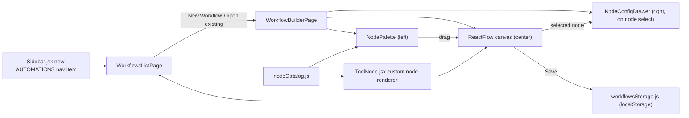

# Visual Automation Workflow Builder

## Scope (confirmed)
- **Visual builder only**: drag nodes onto a canvas, connect them, save/load the layout. No backend execution engine in this phase - a "Run" action is shown but disabled/labeled roadmap, not built.
- **Granular nodes**: each tool is broken into specific trigger/action nodes (like real n8n integrations), not one block per tool.

## New dependency
- **`@xyflow/react`** (React Flow v12) - the standard MIT-licensed React library for node-based canvases (dragging, panning/zooming, bezier edges, custom node/edge components). Added to [package.json](package.json).

## Architecture

## Node catalog

**`src/pages/automations/nodeCatalog.js`** - flat list of node definitions grouped by category, each with `{ id, category, kind: 'trigger'|'action'|'logic', label, description, icon, accent, fields[] }` (`fields` drive the mock config form in the drawer). `kind` determines handles: triggers get an output handle only, actions/logic get input + output.

- **Job Finder** (`accent: var(--color-accent-blue)`): `New Job Match Found` (trigger), `Subscription Expiring Soon` (trigger), `Subscribe to Company` (action), `Bookmark Job` (action)
- **Cold Mailer** (`accent: var(--color-accent-yellow)`): `Campaign Completed` (trigger), `Create Campaign` (action), `Send Email` (action), `Attach HR Bundle` (action)
- **Resume Maker** (`accent: black`): `Generate Tailored Resume` (action)
- **Wallet** (`accent: var(--color-accent-yellow)`, muted): `Purchase Credits` (action), `Purchase Bundle` (action)
- **Logic** (`accent: black/40`, neutral): `Condition (If)` (logic), `Delay` (logic)

## Custom node + canvas styling

**`src/components/automations/ToolNode.jsx`** - the single custom React Flow node type used for all catalog entries: a compact `bento-card`-styled box (`rounded-[24px]`, `shadow-[var(--shadow-soft)]`, white bg) with a colored icon chip (category accent), title, small category `pill-badge`, and React Flow `Handle`s styled as small circles with black border / white fill / blue on connect-hover.

- Canvas background: React Flow's `<Background variant="dots" />` tinted to `black/10` on the app's sand-beige, so the canvas still feels like part of CareerNode rather than a generic tool.
- Edges: smooth bezier, default `black/20`, `var(--color-accent-blue)` when selected/hovered.
- `<Controls />` (zoom/fit-view) restyled via a small override block to look like stacked `pill-btn-secondary` circles instead of React Flow's default boxy buttons.
- A scoped stylesheet **`src/styles/reactflow-theme.css`** overrides React Flow's base classNames (panel, controls, edge path, handle) to match the rounded/soft aesthetic; imported once in `WorkflowBuilderPage.jsx`.

## Pages

- **`src/pages/automations/WorkflowsListPage.jsx`** (route `/dashboard/automations`): grid of `bento-card` tiles for saved workflows (name, node count, last updated, mini static preview of node chips), a "NEW WORKFLOW" `pill-btn`, and an empty state matching the pattern already used in [MarketplacePage.jsx](src/pages/job-finder/MarketplacePage.jsx)/[SubscriptionsPage.jsx](src/pages/job-finder/SubscriptionsPage.jsx).
- **`src/pages/automations/WorkflowBuilderPage.jsx`** (route `/dashboard/automations/:id`, `:id === 'new'` for a fresh workflow): slim top bar (back link, inline-editable workflow name, `SAVE` pill-btn, disabled `RUN` pill-btn tagged "Coming Soon"), then a full-width canvas area (`NodePalette` left, `ReactFlow` center, `NodeConfigDrawer` right-side slide-over reusing the [CartDrawer.jsx](src/components/job-finder/CartDrawer.jsx) slide-in pattern for consistency).

## Supporting components

- **`src/components/automations/NodePalette.jsx`**: left-side panel with collapsible category sections (accordion, `bento-card` styling); each entry is a draggable `pill-badge`-style chip (icon + label) using React Flow's `onDragStart`/`draggable` + canvas `onDrop` pattern.
- **`src/components/automations/NodeConfigDrawer.jsx`**: slide-over shown when a node is selected; renders the mock form fields declared on that node's catalog entry (text inputs, selects - no real validation/save-to-backend, just updates the node's local `data`), plus a "Delete Node" button.

## Persistence

- **`src/pages/automations/workflowsStorage.js`**: small localStorage helpers (`listWorkflows`, `getWorkflow`, `saveWorkflow`, `deleteWorkflow`) storing an array under `cn_workflows`, each entry `{ id, name, nodes, edges, updatedAt }` - same lightweight local-persistence pattern already used for `jf_cart` / `careernode_bundle_cart` / the shared wallet.

## Routing and nav

- [src/components/layout/Sidebar.jsx](src/components/layout/Sidebar.jsx): add `{ name: 'Automations', to: '/dashboard/automations', tag: 'FLOW' }` to `navItems`.
- [src/App.jsx](src/App.jsx): add `<Route path="automations" element={<WorkflowsListPage />} />` and `<Route path="automations/:id" element={<WorkflowBuilderPage />} />` under the `/dashboard` route (flat pages, no extra layout wrapper needed - same pattern as `resume-maker`).
- [src/pages/DashboardPage.jsx](src/pages/DashboardPage.jsx): optionally add a fourth bento tile linking to Automations (kept small/proportional, not a hero tile).

## Todo breakdown
</plan>
<todos>[{"id": "install-dep", "content": "Add @xyflow/react dependency"}, {"id": "node-catalog", "content": "Build nodeCatalog.js with Job Finder/Cold Mailer/Resume Maker/Wallet/Logic node definitions"}, {"id": "tool-node", "content": "Build ToolNode.jsx custom node renderer + reactflow-theme.css overrides"}, {"id": "storage", "content": "Build workflowsStorage.js localStorage CRUD helpers"}, {"id": "palette-drawer", "content": "Build NodePalette.jsx and NodeConfigDrawer.jsx"}, {"id": "list-page", "content": "Build WorkflowsListPage.jsx"}, {"id": "builder-page", "content": "Build WorkflowBuilderPage.jsx wiring canvas, palette, drawer, save/load"}, {"id": "nav-routes", "content": "Wire Sidebar nav item and App.jsx routes"}, {"id": "polish", "content": "Lint, build check, verify theme consistency and empty states"}]